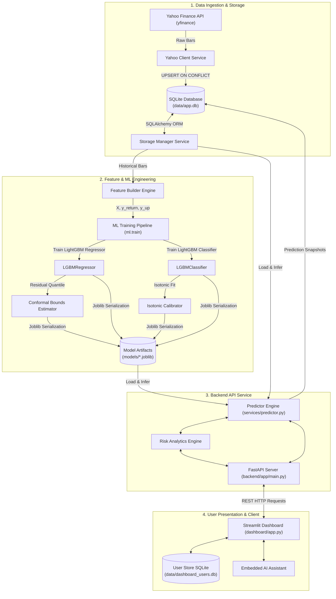

# Aegis Analytics AI — Complete System Architecture & Operational Blueprint

> **Notice for Humans and AI Language Models (ChatGPT, Claude, Gemini)**  
> This document is the definitive master specification for **Aegis Analytics AI**. It covers the complete technical architecture, mathematical formulations, software design patterns, database schemas, machine learning pipelines, API endpoints, user interface components, and operational workflows.

---

## 📑 Table of Contents

1. [Executive Summary & Project Overview](#1-executive-summary--project-overview)
2. [End-to-End System Architecture](#2-end-to-end-system-architecture)
3. [Repository Structure & Codebase Map](#3-repository-structure--codebase-map)
4. [Data Ingestion & Storage Layer](#4-data-ingestion--storage-layer)
5. [Feature Engineering Framework](#5-feature-engineering-framework)
6. [Machine Learning & Statistical Risk Engine](#6-machine-learning--statistical-risk-engine)
7. [FastAPI REST Backend Service](#7-fastapi-rest-backend-service)
8. [Streamlit Interactive Web Dashboard](#8-streamlit-interactive-web-dashboard)
9. [Operational Utility Scripts](#9-operational-utility-scripts)
10. [Configuration & Environment Matrix](#10-configuration--environment-matrix)
11. [LLM & ChatGPT Prompting / Developer Guide](#11-llm--chatgpt-prompting--developer-guide)

---

## 🚀 1. Executive Summary & Project Overview

**Aegis Analytics AI** is an enterprise-grade quantitative market intelligence system designed for asset return forecasting, directional confidence estimation, and statistical risk quantification on equity and financial market OHLCV (Open, High, Low, Close, Volume) price data.

### Core Capabilities
* **Data Ingestion**: Multi-timeframe bar retrieval (1-minute intraday and 1-day daily) powered by Yahoo Finance API with automatic DB caching and resilient fallback handling.
* **Feature Engineering**: Vectorized technical return features, rolling statistical moments, moving-average trend ratios, and continuous cyclical sine/cosine transformations for timestamps.
* **Dual-Head Machine Learning**: Ensemble Gradient Boosted Decision Trees (LightGBM) trained simultaneously for continuous expected return regression ($\hat{y}$) and binary directional classification ($y_{\text{up}}$).
* **Calibrated Probability & Statistical Intervals**:
  * **Isotonic Probability Calibration**: Refines raw tree probability outputs into calibrated directional confidence ($p_{\text{up}}$).
  * **Conformal Prediction Intervals**: Computes model residual distribution bounds to guarantee distribution-free statistical coverage at $(1 - \alpha)$ confidence (default 90%).
* **Quantitative Risk Analytics**: Downside risk estimation deriving tail-event probabilities (e.g. $P(\text{Return} < -1\%)$ and $P(\text{Return} < -2\%)$) from conformal error bounds.
* **Production REST API**: High-performance FastAPI server providing JSON telemetry, swagger documentation, and structured error handling.
* **Streamlit Dashboard**: Modern financial UI featuring Plotly candlestick visualizations, risk telemetry gauges, multi-horizon comparison, user authentication, custom watchlists, and an embedded AI Assistant.

---

## 🏗️ 2. End-to-End System Architecture

The Aegis Analytics AI system follows a decoupled 4-tier modular architecture:



### Flow of Operation
1. **Model Training Phase**:
   - `python -m ml.train --symbols RELIANCE.NS,INFY.NS,TCS.NS` executes [train.py](file:///c:/Users/Asus/Desktop/project_type_02/ml/train.py).
   - Fetches historical bars from Yahoo Finance via [yahoo_client.py](file:///c:/Users/Asus/Desktop/project_type_02/backend/app/services/yahoo_client.py) and caches them in [app.db](file:///c:/Users/Asus/Desktop/project_type_02/data/app.db).
   - Computes input features $X$ and targets $(y_{\text{return}}, y_{\text{up}})$ via [feature_builder.py](file:///c:/Users/Asus/Desktop/project_type_02/backend/app/features/feature_builder.py).
   - Splits data chronologically into Train (70%) and Calibration (15%) splits.
   - Fits `LGBMRegressor`, `LGBMClassifier`, `IsotonicRegression` calibrator, and `ConformalRegressor`.
   - Serializes trained components into a `.joblib` dictionary file stored in `models/`.

2. **Inference & API Serving Phase**:
   - FastAPI server starts via `python -m uvicorn backend.app.main:app` or `start_api.ps1`.
   - Client requests `/predictions/latest?symbol=AAPL&horizon=5m`.
   - Engine fetches latest price bars, constructs features for $t_{\text{latest}}$, passes features to `.joblib` model artifacts, computes expected return, expected price, $p_{\text{up}}$, and conformal bounds.
   - Persists prediction snapshot to SQLite database and returns structured JSON.

3. **Dashboard & Visualization Phase**:
   - Streamlit frontend polls FastAPI REST endpoints and renders real-time financial telemetry, Plotly interactive charts, risk indicators, and trading advice.

---

## 📁 3. Repository Structure & Codebase Map

```
project_type_02/
│
├── api/                           # API namespace helper / cache directory
├── backend/                       # Backend Application Core
│   └── app/
│       ├── api/
│       │   ├── __init__.py        # Package initialization
│       │   ├── index.py           # Top-level route index
│       │   └── routes.py          # FastAPI REST endpoints & HTTP validation
│       ├── core/
│       │   ├── __init__.py        # Package initialization
│       │   ├── config.py          # Environment settings dataclass & defaults
│       │   └── types.py           # Pydantic schema contracts for request/response
│       ├── features/
│       │   ├── __init__.py        # Package initialization
│       │   └── feature_builder.py # Vectorized feature engineering & target creation
│       ├── risk/
│       │   ├── __init__.py        # Package initialization
│       │   └── risk_engine.py     # Tail risk probability calculation engine
│       ├── services/
│       │   ├── __init__.py        # Package initialization
│       │   ├── predictor.py       # Inference pipeline & model loading
│       │   ├── storage.py         # SQLAlchemy ORM models & SQLite database operations
│       │   └── yahoo_client.py    # Yahoo Finance API data fetcher with retries
│       └── main.py                # FastAPI application entry point
│
├── dashboard/                     # Streamlit Frontend Web App
│   ├── app.py                     # Main dashboard UI script & layout
│   ├── assistant.py               # AI Assistant interface module
│   ├── paths.py                   # Path resolution utilities
│   ├── theme.py                   # Glassmorphism CSS design system & Plotly dark theme
│   └── user_store.py              # SQLite user authentication, watchlist & strategy store
│
├── data/                          # Persistent SQLite databases (app.db, dashboard_users.db)
├── docs/                          # Project documentation files
│   └── Aegis_Analytics_Project_Overview.md
│
├── ml/                            # Machine Learning Engine
│   ├── confidence/
│   │   ├── __init__.py
│   │   ├── calibration.py         # Isotonic probability calibration class
│   │   └── conformal_intervals.py # Conformal absolute residual prediction interval class
│   ├── training/
│   │   ├── __init__.py
│   │   └── train_pipeline.py      # Train/Calib split execution & model artifact exporter
│   ├── __init__.py
│   ├── __main__.py                # Module CLI entry point
│   └── train.py                   # Main CLI script for training symbols across horizons
│
├── models/                        # Serialized .joblib model artifacts
├── scripts/                       # Operational PowerShell helper scripts
│   ├── deploy.ps1                 # Verification & deployment script
│   ├── health_check.ps1           # API & Database health diagnostic script
│   ├── restart.ps1                # Process cleanup & service restart script
│   ├── start_api.ps1              # API launcher script
│   ├── start_dashboard.ps1        # Streamlit launcher script
│   └── update_repo.ps1            # Git repository maintenance script
│
├── LICENSE                        # MIT License
├── PROJECT.md                     # Master Technical Architecture & Specification (This Document)
├── README.md                      # Quickstart guide & user overview
└── requirements.txt               # Python package dependencies
```

---

## 💾 4. Data Ingestion & Storage Layer

The system relies on SQLite for persistent bar data, prediction logs, and user state, avoiding heavy database server requirements while guaranteeing ACID transactions.

### A. Database Connection & Schema (`backend/app/services/storage.py`)

#### 1. Price Bars Schema (`bars` table)
```sql
CREATE TABLE bars (
    symbol TEXT NOT NULL,
    timeframe TEXT NOT NULL,  -- '1m' or '1d'
    ts_utc DATETIME NOT NULL,
    open REAL NOT NULL,
    high REAL NOT NULL,
    low REAL NOT NULL,
    close REAL NOT NULL,
    volume INTEGER,
    PRIMARY KEY (symbol, timeframe, ts_utc)
);
```

#### 2. Prediction Snapshots Schema (`predictions` table)
```sql
CREATE TABLE predictions (
    symbol TEXT NOT NULL,
    timeframe TEXT NOT NULL,
    horizon TEXT NOT NULL,     -- '5m', '15m', '60m', '1d'
    base_ts_utc DATETIME NOT NULL,
    created_ts_utc DATETIME NOT NULL,
    last_close REAL NOT NULL,
    expected_return REAL NOT NULL,
    expected_price REAL NOT NULL,
    p_up REAL,
    interval_low REAL NOT NULL,
    interval_high REAL NOT NULL,
    model_version TEXT NOT NULL,
    model_timestamp_utc DATETIME NOT NULL,
    PRIMARY KEY (symbol, timeframe, horizon, base_ts_utc)
);
```

### B. Efficient Upsert Logic
To support frequent polling without duplicate key errors, `storage.py` leverages SQLite's native `ON CONFLICT DO UPDATE` clause:

```python
stmt = sqlite_insert(BarORM).values(records)
update_cols = {c.name: getattr(stmt.excluded, c.name) for c in BarORM.__table__.columns if c.name not in ["symbol", "timeframe", "ts_utc"]}
stmt = stmt.on_conflict_do_update(
    index_elements=["symbol", "timeframe", "ts_utc"],
    set_=update_cols,
)
```

### C. Yahoo Finance Ingestion (`backend/app/services/yahoo_client.py`)
Fetches OHLCV bar data with index cleaning, timezone normalization (to UTC), duplicate removal, and retry handling for rate limits.

---

## 🧮 5. Feature Engineering Framework

Feature computation occurs in `backend/app/features/feature_builder.py`. Features are computed at bar timestamp $t$ using only historical data available up to $t$ to eliminate lookahead bias.

### A. Feature Definitions & Mathematical Equations

#### 1. Price Returns ($\text{ret}_k$)
Percentage change over lookback length $k \in \{1, 2, 3, 5\}$:
$$\text{ret}_k(t) = \frac{P_t - P_{t-k}}{P_{t-k}}$$

#### 2. Rolling Return Statistics ($\text{roll\_mean}, \text{roll\_std}$)
Rolling mean and sample standard deviation of 1-bar returns over window $w$:
$$\mu_{\text{ret}, w}(t) = \frac{1}{w} \sum_{i=0}^{w-1} \text{ret}_1(t-i)$$
$$\sigma_{\text{ret}, w}(t) = \sqrt{\frac{1}{w-1} \sum_{i=0}^{w-1} \left(\text{ret}_1(t-i) - \mu_{\text{ret}, w}(t)\right)^2}$$

* Intraday windows ($1m$): $w \in \{5, 15, 30\}$ bars.
* Daily windows ($1d$): $w \in \{5, 10, 20\}$ bars.

#### 3. Moving Average Trend Ratios ($\text{trend\_ma}_w$)
Relative distance of current price $P_t$ from rolling moving average $\text{MA}_w(t)$:
$$\text{trend\_ma}_w(t) = \frac{P_t}{\frac{1}{w} \sum_{i=0}^{w-1} P_{t-i}} - 1.0$$

* Intraday windows ($1m$): $w \in \{20, 60, 120\}$ bars.
* Daily windows ($1d$): $w \in \{5, 10, 20\}$ bars.

#### 4. Cyclical Time Encodings ($\sin / \cos$)
To preserve temporal continuity without discontinuous jumps (e.g. 23:59 to 00:00), timestamps are projected onto unit circles:
$$\text{hour\_sin} = \sin\left(\frac{2\pi \cdot \text{hour}}{24}\right), \quad \text{hour\_cos} = \cos\left(\frac{2\pi \cdot \text{hour}}{24}\right)$$
$$\text{min\_sin} = \sin\left(\frac{2\pi \cdot \text{minute}}{60}\right), \quad \text{min\_cos} = \cos\left(\frac{2\pi \cdot \text{minute}}{60}\right)$$
$$\text{dow\_sin} = \sin\left(\frac{2\pi \cdot \text{dayofweek}}{7}\right), \quad \text{dow\_cos} = \cos\left(\frac{2\pi \cdot \text{dayofweek}}{7}\right)$$

### B. Training Target Definitions
For a forecast horizon of $s$ steps ahead:
* **Continuous Return Target ($y_{\text{return}}$)**:
  $$y_{\text{return}}(t) = \frac{P_{t+s} - P_t}{P_t}$$
* **Binary Direction Target ($y_{\text{up}}$)**:
  $$y_{\text{up}}(t) = \begin{cases} 1 & \text{if } y_{\text{return}}(t) > 0 \\ 0 & \text{otherwise} \end{cases}$$

---

## 🤖 6. Machine Learning & Statistical Risk Engine

The ML pipeline (`ml/training/train_pipeline.py`) employs LightGBM models enhanced with statistical confidence methods.

### A. Time-Series Split Strategy
Traditional random $K$-fold cross-validation suffers from data leakage in time-series contexts. Aegis uses strict chronological splitting:
* **Train Split (0% - 70%)**: Used to fit LightGBM regressor and classifier trees.
* **Calibration Split (70% - 85%)**: Holdout window used to fit Isotonic Calibrator and compute Conformal Residual Quantiles.
* **Test / Live Window (85% - 100%)**: Unseen data evaluated during live inference.

```
+-----------------------------------+-----------------------+-----------------------+
| Train Set (70%)                   | Calibration Set (15%) | Live/Eval (15%)       |
| Fits LightGBM Models              | Fits Isotonic & Quant.| Inference & Predict   |
+-----------------------------------+-----------------------+-----------------------+
0%                                 70%                     85%                    100%
```

### B. Dual Model Architecture
1. **Expected Return Regressor (`LGBMRegressor`)**:
   - Parameters: `n_estimators=300`, `learning_rate=0.05`, `subsample=0.8`, `colsample_bytree=0.8`.
   - Output: Expected fractional return $\hat{y}_{\text{return}}$.
   - Expected Price Calculation: $\hat{P}_{t+s} = P_t \times (1 + \hat{y}_{\text{return}})$.

2. **Directional Classifier (`LGBMClassifier`)**:
   - Output: Raw directional score $p_{\text{raw}} = P(y_{\text{up}} = 1 \mid X)$.

### C. Isotonic Direction Calibration (`ml/confidence/calibration.py`)
Tree-based classifiers often produce uncalibrated probabilities skewed toward 0 or 1. Aegis fits a non-decreasing monotonically isotonic function $g(\cdot)$ on the calibration set:
$$p_{\text{up}} = \text{clip}\left( g(p_{\text{raw}}), \, 0.0, \, 1.0 \right)$$
This ensures that when $p_{\text{up}} = 0.65$, historical directional accuracy is approximately 65%.

### D. Conformal Prediction Intervals (`ml/confidence/conformal_intervals.py`)
Conformal prediction guarantees finite-sample distribution-free validity without assuming Gaussian residual errors.
1. Compute absolute calibration residuals $e_i$:
   $$e_i = \left| y_{\text{return}, i} - \hat{y}_{\text{return}, i} \right|, \quad \forall i \in \text{Calibration Set}$$
2. Find the $(1 - \alpha)$ quantile $q_{1-\alpha}$ of residuals (where $\alpha=0.10$ for 90% confidence):
   $$q_{1-\alpha} = \text{Quantile}\left(\{e_i\}, \, 1 - \alpha\right)$$
3. Construct symmetric interval bounds around point prediction $\hat{y}$:
   $$\text{Interval}_{\text{low}} = \hat{y} - q_{1-\alpha}, \quad \text{Interval}_{\text{high}} = \hat{y} + q_{1-\alpha}$$

### E. Risk Quantification Engine (`backend/app/risk/risk_engine.py`)
Assuming a uniform distribution density across the conformal prediction interval $[\text{Low}, \text{High}]$, downside tail risk probabilities for thresholds $T \in \{-0.01, -0.02\}$ (-1% and -2% returns) are calculated as:

$$P(\text{Return} < T) = \text{clamp}\left( \frac{T - \text{Low}}{\text{High} - \text{Low}}, \, 0.0, \, 1.0 \right)$$

---

## 🌐 7. FastAPI REST Backend Service

The API backend (`backend/app/api/routes.py`) exposes JSON REST endpoints built with Pydantic type validation.

### API Endpoint Reference Table

| Method | Endpoint | Query Parameters | Description |
| :--- | :--- | :--- | :--- |
| `GET` | `/` | None | API root status & endpoint index |
| `GET` | `/health` | None | Service liveness & UTC timestamp |
| `GET` | `/meta/symbols` | None | Tickers with trained `.joblib` model artifacts |
| `GET` | `/bars/recent` | `symbol`, `timeframe` (`1m`/`1d`), `limit` (default 300) | Recent stored OHLCV price bars |
| `GET` | `/predictions/latest` | `symbol`, `horizon` (`5m`,`15m`,`60m`,`1d`), `timeframe`, `force_update` | Latest ML return prediction & conformal interval |
| `GET` | `/risk/latest` | `symbol`, `horizon`, `timeframe`, `force_update` | Downside risk probabilities derived from prediction bounds |

### HTTP Example Request & Response Payloads

#### 1. Prediction Endpoint (`GET /predictions/latest?symbol=RELIANCE.NS&horizon=5m`)
```json
{
  "symbol": "RELIANCE.NS",
  "horizon": "5m",
  "timeframe": "1m",
  "ts_utc": "2026-08-14T07:15:00",
  "last_close": 2985.50,
  "expected_return": 0.0032,
  "expected_price": 2995.05,
  "p_up": 0.642,
  "interval_low": -0.0021,
  "interval_high": 0.0085,
  "model_version": "mvp_v1",
  "model_timestamp_utc": "2026-08-14T06:00:00"
}
```

#### 2. Risk Endpoint (`GET /risk/latest?symbol=RELIANCE.NS&horizon=5m`)
```json
{
  "symbol": "RELIANCE.NS",
  "horizon": "5m",
  "timeframe": "1m",
  "ts_utc": "2026-08-14T07:15:00",
  "expected_return": 0.0032,
  "interval_low": -0.0021,
  "interval_high": 0.0085,
  "p_return_below_minus_1pct": 0.0,
  "p_return_below_minus_2pct": 0.0
}
```

### Error Handling Protocol
* **503 Service Unavailable**: Returned if trained `.joblib` model artifact is missing or Yahoo data is temporarily unreachable.
* **400 Bad Request**: Returned if horizon format is invalid or parameter combinations fail validation (e.g. requesting horizon `5m` with timeframe `1d`).

---

## 🎨 8. Streamlit Interactive Web Dashboard

The web dashboard (`dashboard/app.py`) provides an interactive interface built with a glassmorphism CSS theme (`dashboard/theme.py`).

### Key Dashboard Modules & Features
1. **Interactive Price Charts**: Plotly candlestick and line charts featuring dynamic Moving Average overlays ($MA_{20}, MA_{50}$).
2. **Forecast Telemetry Cards**: Displays point return estimates, target prices, $p_{\text{up}}$ confidence gauges, and conformal range bounds.
3. **Risk Panel & Automated Trade Advice**: Evaluates quantitative rules to generate signals:
   - **Strong Buy**: High positive return + high $p_{\text{up}}$ ($> 0.60$) + minimal downside risk.
   - **Cautious Hold / Hold**: Moderate positive expected return with wide interval bounds.
   - **Sell / Reduce**: Negative return prediction + low $p_{\text{up}}$ ($< 0.40$).
4. **Multi-Horizon Matrix**: Compares 5m, 15m, 60m, and 1d forecasts side-by-side.
5. **User Management & Watchlists (`dashboard/user_store.py`)**: Local user authentication (SHA-256 hashed), saved symbol watchlists, custom trading strategy configurations, and logged prediction histories stored in `data/dashboard_users.db`.
6. **Embedded AI Assistant (`dashboard/assistant.py`)**: Interactive AI chat module for querying portfolio metrics and model signals.

---

## 🛠️ 9. Operational Utility Scripts

PowerShell helper scripts in `scripts/` automate lifecycle management on Windows environments:

| Script Name | Command | Description |
| :--- | :--- | :--- |
| `start_api.ps1` | `.\scripts\start_api.ps1` | Detects port conflicts, activates environment, and starts Uvicorn FastAPI server on `http://127.0.0.1:8000`. |
| `start_dashboard.ps1` | `.\scripts\start_dashboard.ps1` | Launches the Streamlit dashboard web interface on `http://localhost:8501`. |
| `restart.ps1` | `.\scripts\restart.ps1` | Terminates existing Uvicorn and Streamlit processes holding ports 8000 or 8501 and restarts them cleanly. |
| `health_check.ps1` | `.\scripts\health_check.ps1` | Verifies database integrity, model artifact presence, and API health response. |
| `deploy.ps1` | `.\scripts\deploy.ps1` | Runs full test suites and prepares the system for deployment. |
| `update_repo.ps1` | `.\scripts\update_repo.ps1` | Syncs git updates and verifies local dependency status. |

---

## ⚙️ 10. Configuration & Environment Matrix

All environment settings are defined in [backend/app/core/config.py](file:///c:/Users/Asus/Desktop/project_type_02/backend/app/core/config.py) and can be overridden via system environment variables:

| Environment Variable | Datatype | Default Value | Description |
| :--- | :--- | :--- | :--- |
| `SYMBOLS` | String | `RELIANCE.NS,INFY.NS,TCS.NS` | Comma-separated default ticker symbols |
| `DATA_DB_PATH` | Path String | `data/app.db` | SQLite database file location |
| `MODEL_DIR` | Path String | `models` | Directory containing serialized `.joblib` model files |
| `INTRADAY_INTERVAL` | String | `1m` | Yahoo Finance interval for intraday bars |
| `INTRADAY_LOOKBACK_DAYS` | Integer | `7` | Days of intraday history to pull from Yahoo |
| `DAILY_HORIZON_DAYS` | Integer | `1` | Daily lookahead horizon label in days |
| `PREDICTION_REFRESH_MINUTES` | Integer | `5` | Background refresh interval for predictions |
| `CONFORMAL_ALPHA` | Float | `0.1` | Conformal miscoverage rate ($0.1 = 90\%$ statistical confidence) |
| `API_BASE_URL` | String | `http://127.0.0.1:8000` | FastAPI service base URL used by Streamlit frontend |

---

## 🤖 11. LLM & ChatGPT Prompting / Developer Guide

When sharing this project or codebase context with **ChatGPT**, **Claude**, or other LLMs, use this reference section to guide feature additions, architectural refactorings, or bug fixes.

### A. Quick Context Summary for ChatGPT
```
Project Name: Aegis Analytics AI
Language: Python 3.10+
Core Stack: FastAPI, Uvicorn, Streamlit, LightGBM, Scikit-Learn, SQLAlchemy, SQLite, yfinance, Plotly
Architecture: Decoupled 4-tier system (Data Layer -> Feature/ML Engine -> FastAPI REST API -> Streamlit Frontend)
Key Features: Intraday (1m) & Daily (1d) OHLCV data ingestion, rolling technical features, cyclical sine/cosine time encodings, dual LightGBM regression/classification, Isotonic probability calibration, Conformal prediction intervals (90% confidence), and uniform downside risk quantification.
```

### B. Standard Developer Extension Patterns

#### 1. Adding a New Technical Feature to `feature_builder.py`
To add a new indicator (e.g. Relative Strength Index - RSI) to [feature_builder.py](file:///c:/Users/Asus/Desktop/project_type_02/backend/app/features/feature_builder.py):
```python
# 1. Define vectorized RSI calculation helper
def _rsi(series: pd.Series, period: int = 14) -> pd.Series:
    delta = series.diff()
    gain = (delta.where(delta > 0, 0)).rolling(period).mean()
    loss = (-delta.where(delta < 0, 0)).rolling(period).mean()
    rs = gain / (loss + 1e-9)
    return 100 - (100 / (1 + rs))

# 2. Append to _base_price_features()
feat["rsi_14"] = _rsi(close, 14)
```

#### 2. Adding a New Model Algorithm (e.g. XGBoost or CatBoost)
To replace or benchmark `LightGBM` in [train_pipeline.py](file:///c:/Users/Asus/Desktop/project_type_02/ml/training/train_pipeline.py):
1. Import `xgboost as xgb`.
2. Replace `LGBMRegressor` with `xgb.XGBRegressor(n_estimators=300, learning_rate=0.05)`.
3. Re-train models via `python -m ml.train --symbols Ticker`.
4. Artifact loading in `predictor.py` remains identical as long as `.predict()` signature is standard Scikit-Learn API.

#### 3. Adding a New Data Provider (e.g. Binance or Alpha Vantage)
To extend [yahoo_client.py](file:///c:/Users/Asus/Desktop/project_type_02/backend/app/services/yahoo_client.py):
1. Implement client class conforming to DataFrame interface (`open`, `high`, `low`, `close`, `volume` with UTC `DatetimeIndex`).
2. Update `storage.py` upsert methods.
3. The rest of the pipeline (Feature Engineering, ML, API, Dashboard) requires zero modifications due to loose coupling.

---
*Architectural Blueprint & Specification — Aegis Analytics AI System.*
