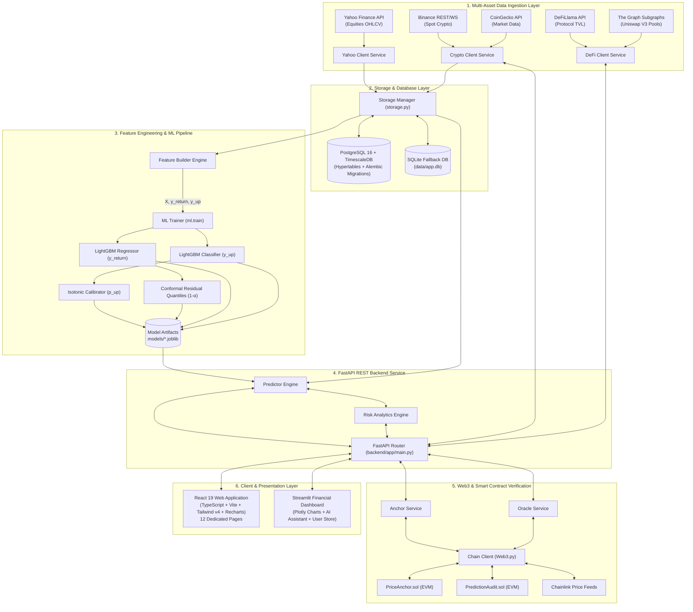

# Aegis Analytics AI — Complete System Architecture & Master Specification

> **Definitive Master Technical Blueprint & Engineering Guide**  
> This document is the definitive master specification for **Aegis Analytics AI**. It covers the complete technical architecture, mathematical formulations, software design patterns, database schemas, machine learning pipelines, smart contracts, Web3 cryptographic verification, REST API endpoints, user interface components, and operational workflows.

---

## 📑 Table of Contents

1. [Executive Summary & Core Objectives](#1-executive-summary--core-objectives)
2. [End-to-End System Architecture](#2-end-to-end-system-architecture)
3. [Repository Structure & Codebase Map](#3-repository-structure--codebase-map)
4. [Data Ingestion, Storage & Migration Layer](#4-data-ingestion-storage--migration-layer)
5. [Feature Engineering Framework & Mathematical Formulas](#5-feature-engineering-framework--mathematical-formulas)
6. [Dual-Head ML & Conformal Risk Engine](#6-dual-head-ml--conformal-risk-engine)
7. [Web3 Cryptographic Anchoring & Smart Contracts](#7-web3-cryptographic-anchoring--smart-contracts)
8. [FastAPI REST Backend Service Specification](#8-fastapi-rest-backend-service-specification)
9. [Frontend Application Architecture (React 19 & Streamlit)](#9-frontend-application-architecture-react-19--streamlit)
10. [Operational Automation & PowerShell Scripts](#10-operational-automation--powershell-scripts)
11. [Configuration & Environment Variable Matrix](#11-configuration--environment-variable-matrix)
12. [Developer Extension Patterns & AI Agent Guide](#12-developer-extension-patterns--ai-agent-guide)

---

## 🚀 1. Executive Summary & Core Objectives

**Aegis Analytics AI** is an enterprise-grade quantitative market intelligence and decentralized audit platform designed for asset return forecasting, directional confidence estimation, distribution-free statistical risk quantification, and cryptographic on-chain verification across equities, crypto, and DeFi assets.

### Key Capabilities & Pillars
* **Multi-Asset Ingestion**: Real-time and historical bar retrieval for equities (Yahoo Finance), cryptocurrency spot pairs (Binance REST/WebSocket & CoinGecko), and decentralized finance metrics (DeFiLlama TVL & Uniswap V3 via The Graph).
* **Feature Engineering**: Vectorized technical return features, rolling statistical moments, moving-average trend ratios, and continuous cyclical sine/cosine timestamp transformations.
* **Dual-Head Machine Learning**: Ensemble Gradient Boosted Decision Trees (LightGBM) trained simultaneously for continuous expected return regression ($\hat{y}_{\text{return}}$) and binary directional classification ($y_{\text{up}}$).
* **Mathematical Confidence & Risk**:
  * **Isotonic Probability Calibration**: Refines raw tree probability outputs into true, calibrated directional confidence ($p_{\text{up}}$).
  * **Conformal Prediction Intervals**: Computes empirical absolute residual quantiles to guarantee distribution-free finite-sample statistical coverage at $(1 - \alpha)$ confidence (default 90%).
  * **Downside Tail-Risk Quantification**: Mathematical derivation of downside event probabilities ($P(\text{Return} < -1\%)$ and $P(\text{Return} < -2\%)$) from conformal error distributions.
* **Blockchain Cryptographic Auditability**:
  * **Solidity Smart Contracts**: `PriceAnchor.sol` and `PredictionAudit.sol` deployed via Hardhat to EVM networks (Sepolia, Polygon, Localhost).
  * **Cryptographic Hashing**: SHA-256 state hashing and on-chain timestamping of market bars and prediction snapshots before market outcomes occur.
  * **Chainlink Price Oracles**: Real-time decentralized oracle price feeds with off-chain fallback resolvers.
* **Presentation Layer**:
  * **React 19 SPA**: Ultra-modern single-page application built with React 19, TypeScript 6, Vite 8, Tailwind CSS v4, Recharts 3, and Lucide React featuring 12 dedicated analytical pages.
  * **Streamlit Dashboard**: Glassmorphic financial dashboard with Plotly candlestick charts, interactive risk gauges, and an embedded AI Market Assistant.
* **Enterprise Persistence**: PostgreSQL 16 with TimescaleDB hypertables, Alembic schema migrations, and a zero-configuration SQLite local development fallback.

---

## 🏗️ 2. End-to-End System Architecture



---

## 📁 3. Repository Structure & Codebase Map

```
project_type_02/
├── backend/                       # Backend Application Core
│   └── app/
│       ├── api/
│       │   ├── __init__.py        # Package initialization
│       │   ├── index.py           # Route index catalog
│       │   └── routes.py          # Complete FastAPI route handlers & Pydantic validation
│       ├── blockchain/
│       │   ├── __init__.py
│       │   ├── anchor_service.py  # SHA-256 price/prediction hash creation & on-chain anchoring
│       │   ├── chain_client.py    # Web3.py RPC node connection & transaction signing
│       │   ├── event_listener.py  # Blockchain event listener for anchor confirmation
│       │   └── oracle_service.py  # Chainlink decentralized oracle price client
│       ├── core/
│       │   ├── __init__.py
│       │   ├── config.py          # Settings dataclass, environment parsing & defaults
│       │   └── types.py           # Pydantic schemas for HTTP request & response models
│       ├── db/
│       │   └── migrations/        # Alembic database migrations
│       │       ├── env.py         # Migration environment runner
│       │       └── versions/      # Version scripts (001_init, 002_blockchain)
│       ├── features/
│       │   ├── __init__.py
│       │   └── feature_builder.py # Vectorized return features & cyclical time encodings
│       ├── risk/
│       │   ├── __init__.py
│       │   └── risk_engine.py     # Downside tail-risk estimation formulas
│       ├── services/
│       │   ├── __init__.py
│       │   ├── crypto_client.py   # Binance REST/WS & CoinGecko client
│       │   ├── defi_client.py     # DeFiLlama TVL & Uniswap The Graph client
│       │   ├── predictor.py       # In-memory model artifact loader & inference engine
│       │   ├── storage.py         # SQLAlchemy ORM models & database CRUD methods
│       │   └── yahoo_client.py    # Yahoo Finance market data fetcher with retries
│       └── main.py                # FastAPI application entry point & CORS configuration
│
├── contracts/                     # Web3 Smart Contracts (Solidity 0.8.20 / Hardhat)
│   ├── PredictionAudit.sol        # Immutable on-chain forecast hash and accuracy audit contract
│   ├── PriceAnchor.sol            # On-chain OHLCV bar anchor contract
│   └── scripts/                   # Hardhat deployment scripts
│
├── dashboard/                     # Streamlit Frontend Web App
│   ├── app.py                     # Main dashboard layout, charts & risk panels
│   ├── assistant.py               # Embedded AI Assistant interactive interface
│   ├── paths.py                   # Path resolution utilities
│   ├── theme.py                   # Glassmorphism CSS design system & Plotly dark themes
│   └── user_store.py              # SQLite user authentication & watchlist storage
│
├── data/                          # Persistent SQLite database storage (local dev fallback)
├── docs/                          # In-depth system documentation
│   └── Aegis_Analytics_Project_Overview.md
│
├── frontend/                      # React 19 + TypeScript + Vite + Tailwind CSS v4 Web App
│   ├── public/                    # Static favicon & icons
│   ├── src/
│   │   ├── assets/                # Visual SVG brand assets
│   │   ├── components/
│   │   │   └── auth/              # BrandLogo, FinancialVisualization & auth cards
│   │   ├── layouts/
│   │   │   └── AppLayout.tsx      # Unified responsive sidebar shell
│   │   ├── pages/                 # 12 analytical pages (Overview, Market, Forecasts, Risk, etc.)
│   │   ├── services/
│   │   │   └── api.ts             # Typed HTTP client communicating with FastAPI backend
│   │   ├── types/
│   │   │   └── api.ts             # TypeScript interfaces for API responses
│   │   ├── App.css                # Global animations & glassmorphism utilities
│   │   ├── App.tsx                # Master view router & layout coordinator
│   │   ├── index.css              # Tailwind CSS v4 directives
│   │   └── main.tsx               # Frontend root entry point
│   ├── package.json               # Frontend dependencies (React 19, Vite 8, Tailwind v4, Recharts)
│   └── README.md                  # Dedicated frontend documentation
│
├── ml/                            # Machine Learning Engine
│   ├── confidence/
│   │   ├── __init__.py
│   │   ├── calibration.py         # Isotonic probability calibration class
│   │   └── conformal_intervals.py # Conformal prediction residual quantile estimator
│   ├── training/
│   │   ├── __init__.py
│   │   └── train_pipeline.py      # Chronological split training & joblib exporter
│   ├── __init__.py
│   ├── __main__.py                # Module CLI entry point
│   └── train.py                   # Multi-symbol, multi-horizon training CLI script
│
├── models/                        # Serialized .joblib model artifacts
├── scripts/                       # Operational PowerShell helper scripts
│   ├── deploy.ps1                 # Deployment & verification script
│   ├── health_check.ps1           # API & Database health diagnostic script
│   ├── restart.ps1                # Process cleanup & service restart script
│   ├── start_api.ps1              # FastAPI Uvicorn launcher script
│   ├── start_dashboard.ps1        # Streamlit launcher script
│   └── update_repo.ps1            # Git repository maintenance script
│
├── alembic.ini                    # Alembic migration configuration
├── docker-compose.yml             # PostgreSQL/TimescaleDB, API, and Dashboard container orchestrator
├── hardhat.config.js              # Hardhat EVM network configuration
├── LICENSE                        # MIT License
├── PROJECT.md                     # Master Technical Architecture (This Document)
├── README.md                      # Quickstart guide & user overview
└── requirements.txt               # Python package dependencies
```

---

## 💾 4. Data Ingestion, Storage & Migration Layer

### A. Database Support Matrix
1. **Production Engine**: **PostgreSQL 16 + TimescaleDB** (via `psycopg2-binary` and `asyncpg`). TimescaleDB hypertables partition price bars by timestamp for optimal time-series query performance.
2. **Local Development Fallback**: **SQLite** (`data/app.db`) managed through SQLAlchemy ORM with native `sqlite_insert(...).on_conflict_do_update(...)`.

### B. SQLAlchemy ORM Schemas (`backend/app/services/storage.py`)

#### 1. Price Bars Table (`bars`)
```python
class BarORM(Base):
    __tablename__ = "bars"
    symbol    = Column(String, primary_key=True)
    timeframe = Column(String, primary_key=True)  # '1m', '1d'
    ts_utc    = Column(DateTime, primary_key=True)
    open      = Column(Float, nullable=False)
    high      = Column(Float, nullable=False)
    low       = Column(Float, nullable=False)
    close     = Column(Float, nullable=False)
    volume    = Column(BigInteger, nullable=True)
```

#### 2. Predictions Table (`predictions`)
```python
class PredictionORM(Base):
    __tablename__ = "predictions"
    symbol              = Column(String, primary_key=True)
    timeframe           = Column(String, primary_key=True)
    horizon             = Column(String, primary_key=True)  # '5m', '15m', '60m', '1d'
    base_ts_utc         = Column(DateTime, primary_key=True)
    created_ts_utc      = Column(DateTime, nullable=False)
    last_close          = Column(Float, nullable=False)
    expected_return     = Column(Float, nullable=False)
    expected_price      = Column(Float, nullable=False)
    p_up                = Column(Float, nullable=True)
    interval_low        = Column(Float, nullable=False)
    interval_high       = Column(Float, nullable=False)
    model_version       = Column(String, nullable=False)
    model_timestamp_utc = Column(DateTime, nullable=False)
```

#### 3. Blockchain Anchors Table (`blockchain_anchors`)
```python
class BlockchainAnchorORM(Base):
    __tablename__ = "blockchain_anchors"
    id           = Column(Integer, primary_key=True, autoincrement=True)
    anchor_type  = Column(String, nullable=False)   # 'price' or 'prediction'
    ref_symbol   = Column(String, nullable=False)
    ref_horizon  = Column(String, nullable=True)
    ref_ts_utc   = Column(DateTime, nullable=True)
    data_hash    = Column(String(66), nullable=False)  # 0x + 64 hex chars (SHA-256)
    tx_hash      = Column(String(66), nullable=False, unique=True)
    block_number = Column(BigInteger, nullable=True)
    chain_id     = Column(Integer, nullable=False)
    gas_used     = Column(BigInteger, nullable=True)
    created_at   = Column(DateTime, nullable=False)
```

### C. Alembic Schema Migrations
Database migrations are version-controlled in `backend/app/db/migrations/`:
- `001_init_bars_predictions.py`: Creates `bars` and `predictions` tables with multi-column composite primary keys.
- `002_add_blockchain_tables.py`: Creates `blockchain_anchors` table with unique transaction hash indexing.

---

## 🧮 5. Feature Engineering Framework & Mathematical Formulas

Feature computation occurs in [`backend/app/features/feature_builder.py`](file:///c:/Users/Asus/Desktop/project_type_02/backend/app/features/feature_builder.py). Features are strictly computed using historical data up to bar timestamp $t$ to eliminate lookahead bias.

### 1. Price Returns ($\text{ret}_k$)
Percentage change over lookback $k \in \{1, 2, 3, 5\}$:
$$\text{ret}_k(t) = \frac{P_t - P_{t-k}}{P_{t-k}}$$

### 2. Rolling Return Statistics ($\mu_{\text{ret}, w}, \sigma_{\text{ret}, w}$)
Rolling mean and sample standard deviation of 1-bar returns over window $w$:
$$\mu_{\text{ret}, w}(t) = \frac{1}{w} \sum_{i=0}^{w-1} \text{ret}_1(t-i)$$
$$\sigma_{\text{ret}, w}(t) = \sqrt{\frac{1}{w-1} \sum_{i=0}^{w-1} \left(\text{ret}_1(t-i) - \mu_{\text{ret}, w}(t)\right)^2}$$
- Intraday ($1m$): $w \in \{5, 15, 30\}$ bars.
- Daily ($1d$): $w \in \{5, 10, 20\}$ bars.

### 3. Moving Average Trend Ratios ($\text{trend\_ma}_w$)
Relative distance of current close price $P_t$ from rolling moving average $\text{MA}_w(t)$:
$$\text{trend\_ma}_w(t) = \frac{P_t}{\frac{1}{w} \sum_{i=0}^{w-1} P_{t-i}} - 1.0$$
- Intraday ($1m$): $w \in \{20, 60, 120\}$ bars.
- Daily ($1d$): $w \in \{5, 10, 20\}$ bars.

### 4. Cyclical Continuous Time Encodings
To avoid boundary discontinuities (e.g. 23:59 transitioning to 00:00), timestamps are projected onto unit trigonometric circles:
$$\text{hour\_sin} = \sin\left(\frac{2\pi \cdot \text{hour}}{24}\right), \quad \text{hour\_cos} = \cos\left(\frac{2\pi \cdot \text{hour}}{24}\right)$$
$$\text{min\_sin} = \sin\left(\frac{2\pi \cdot \text{minute}}{60}\right), \quad \text{min\_cos} = \cos\left(\frac{2\pi \cdot \text{minute}}{60}\right)$$
$$\text{dow\_sin} = \sin\left(\frac{2\pi \cdot \text{dayofweek}}{7}\right), \quad \text{dow\_cos} = \cos\left(\frac{2\pi \cdot \text{dayofweek}}{7}\right)$$

---

## 🤖 6. Dual-Head ML & Conformal Risk Engine

### A. Chronological Split Strategy
To eliminate data leakage, Aegis employs a strict chronological time-series split:
- **Train Split (0% - 70%)**: Fits `LGBMRegressor` and `LGBMClassifier` trees.
- **Calibration Split (70% - 85%)**: Holdout window used to fit the `IsotonicRegression` calibrator and compute conformal residual quantiles.
- **Live / Inference Window (85% - 100%)**: Unseen data evaluated during live serving.

### B. Dual-Head Model Architecture
1. **Expected Return Regressor (`LGBMRegressor`)**:
   - Predicts future percentage return: $\hat{y}_{\text{return}} = \mathbb{E}\left[\frac{P_{t+s} - P_t}{P_t} \;\middle|\; X_t\right]$.
   - Target price calculation: $\hat{P}_{t+s} = P_t \times (1 + \hat{y}_{\text{return}})$.
2. **Directional Classifier (`LGBMClassifier`)**:
   - Predicts probability of upward movement: $p_{\text{raw}} = P(y_{\text{return}} > 0 \mid X_t)$.

### C. Isotonic Direction Calibration (`ml/confidence/calibration.py`)
Tree probabilities are passed through a fitted monotonically non-decreasing mapping $g(\cdot)$:
$$p_{\text{up}} = \text{clip}\left( g(p_{\text{raw}}), \, 0.0, \, 1.0 \right)$$

### D. Conformal Prediction Intervals (`ml/confidence/conformal_intervals.py`)
Conformal prediction guarantees finite-sample coverage at confidence level $(1 - \alpha)$ (default $\alpha=0.10$ for 90% coverage):
1. Compute absolute calibration residuals: $e_i = |y_i - \hat{y}_i|, \; \forall i \in \text{Calibration Set}$.
2. Determine the empirical quantile: $q_{1-\alpha} = \text{Quantile}(\{e_i\}, 1 - \alpha)$.
3. Construct prediction bounds:
   $$\text{Interval}_{\text{low}} = \hat{y} - q_{1-\alpha}, \quad \text{Interval}_{\text{high}} = \hat{y} + q_{1-\alpha}$$

### E. Downside Tail-Risk Engine (`backend/app/risk/risk_engine.py`)
Assuming a uniform residual density across the conformal interval $[\text{Low}, \text{High}]$, the probability of returns falling below threshold $T \in \{-0.01, -0.02\}$ (-1% and -2%) is calculated as:
$$P(\text{Return} < T) = \text{clamp}\left(\frac{T - \text{Low}}{\text{High} - \text{Low}}, \, 0.0, \, 1.0\right)$$

---

## ⛓️ 7. Web3 Cryptographic Anchoring & Smart Contracts

### A. Solidity Smart Contracts (`contracts/`)
1. **`PriceAnchor.sol`**:
   - Records immutable cryptographic hashes of OHLCV bars.
   - Emits `PriceAnchored(bytes32 indexed dataHash, string symbol, uint256 timestamp, uint256 blockNumber)`.
2. **`PredictionAudit.sol`**:
   - Records forecast vectors (expected return, bounds, model version) prior to horizon execution.
   - Emits `PredictionAudited(bytes32 indexed predHash, string symbol, string horizon, int256 expectedReturn, uint256 blockNumber)`.

### B. Supported EVM Networks
- **Localhost**: Hardhat Node (`http://127.0.0.1:8545`, Chain ID `31337` / `1337`)
- **Sepolia Testnet**: Ethereum Testnet (Chain ID `11155111`)
- **Polygon Mainnet**: Proof-of-Stake Network (Chain ID `137`)
- **Polygon Amoy Testnet**: Modern Polygon Testnet (Chain ID `80002`)

### C. Oracle Feeds (`backend/app/blockchain/oracle_service.py`)
Queries Chainlink AggregatorV3 interfaces on-chain for live prices (e.g. `ETH/USD`, `BTC/USD`), with seamless fallback to off-chain exchange aggregators.

---

## 🌐 8. FastAPI REST Backend Service Specification

The API backend (`backend/app/api/routes.py`) provides high-throughput JSON endpoints:

### Complete Endpoint Reference

| Method | Endpoint | Query Parameters | Description |
| :--- | :--- | :--- | :--- |
| `GET` | `/` | None | API service information, status & route index |
| `GET` | `/health` | None | Liveness check returning status `ok` and UTC timestamp |
| `GET` | `/meta/symbols` | None | Symbols with pre-trained `.joblib` model artifacts |
| `GET` | `/bars/recent` | `symbol`, `timeframe`, `limit` | Historical OHLCV bars (with automatic on-demand Yahoo fetch) |
| `GET` | `/predictions/latest` | `symbol`, `horizon`, `timeframe`, `force_update` | Latest ML expected return, target price, $p_{\text{up}}$, and conformal bounds |
| `GET` | `/risk/latest` | `symbol`, `horizon`, `timeframe`, `force_update` | Downside risk probabilities derived from prediction interval |
| `POST` | `/auth/login` | JSON body (`username`, `password`) | User authentication & JWT session token issuance |
| `POST` | `/auth/register` | JSON body (`username`, `password`) | Register new user account |
| `GET` | `/blockchain/status` | None | Web3 RPC connection state, chain ID, and contract addresses |
| `GET` | `/blockchain/anchors/{symbol}` | `symbol`, `limit` | Query on-chain anchor history for a symbol |
| `GET` | `/blockchain/verify/{tx_hash}` | `tx_hash` (path param) | Verify SHA-256 data hash & block explorer URL |
| `POST` | `/blockchain/anchor-prediction`| `symbol`, `horizon`, `timeframe` | Manually trigger on-chain prediction anchoring |
| `GET` | `/oracle/prices/{pair}` | `pair` (e.g. `ETH/USD`, `AAPL`) | Chainlink decentralized oracle price with fallback |
| `GET` | `/crypto/symbols` | None | Supported cryptocurrency spot pairs |
| `GET` | `/crypto/bars/recent` | `symbol`, `interval`, `limit` | Crypto OHLCV bar history from Binance |
| `GET` | `/defi/protocols` | None | Supported DeFi protocol slugs |
| `GET` | `/defi/tvl/{protocol}` | `protocol` (e.g. `aave`) | Total Value Locked (TVL) from DeFiLlama |
| `GET` | `/defi/global` | None | Global aggregate DeFi TVL and market statistics |
| `GET` | `/defi/uniswap/pools` | `limit` | Top Uniswap V3 liquidity pools via The Graph |

---

## 🎨 9. Frontend Application Architecture (React 19 & Streamlit)

### A. React 19 Modern SPA (`frontend/`)
- **Core Stack**: React 19, TypeScript 6, Vite 8, Tailwind CSS v4, Recharts 3, Lucide React, Oxlint.
- **12 Dedicated Pages**:
  1. `OverviewPage.tsx`: Executive telemetry, index cards, portfolio return stats, and active forecasts.
  2. `MarketAnalyticsPage.tsx`: Interactive candlestick charts with technical indicators (SMA, EMA, RSI, MACD).
  3. `ForecastsPage.tsx`: Dual-head ML returns, directional $p_{\text{up}}$ confidence, conformal intervals.
  4. `RiskAnalyticsPage.tsx`: Downside tail-risk probabilities, VaR, CVaR, and volatility gauges.
  5. `CryptoDefiPage.tsx`: Binance spot market streaming & DeFiLlama TVL analytics.
  6. `AIAnalystPage.tsx`: Autonomous quantitative conversational assistant & signal explanations.
  7. `BlockchainAuditPage.tsx`: Web3 prediction anchoring explorer & cryptographic hash verifier.
  8. `InsightsPage.tsx`: Macro sentiment & quantitative factor attribution.
  9. `ReportsPage.tsx`: Exportable audit reports and intelligence summaries.
  10. `WatchlistPage.tsx`: Custom equity & crypto watchlists with real-time alerts.
  11. `SettingsPage.tsx`: RPC endpoint configuration, API keys, and ML hyperparameters.
  12. `LoginPage.tsx`: Glassmorphism authentication interface with demo presets.

### B. Streamlit Dashboard (`dashboard/`)
- **Core Stack**: Streamlit, Plotly, Custom Glassmorphism CSS Theme (`dashboard/theme.py`).
- **Features**: Candlestick charts, multi-horizon forecast matrix (5m, 15m, 60m, 1d), automated trading advice rules (*Buy*, *Hold*, *Sell/Reduce*), user authentication store (`dashboard/user_store.py`), and embedded AI Assistant (`dashboard/assistant.py`).

---

## 🛠️ 10. Operational Automation & PowerShell Scripts

| Script Name | Command | Description |
| :--- | :--- | :--- |
| `start_api.ps1` | `.\scripts\start_api.ps1` | Resolves port conflicts and launches Uvicorn FastAPI backend on `http://127.0.0.1:8000`. |
| `start_dashboard.ps1` | `.\scripts\start_dashboard.ps1` | Launches the Streamlit dashboard on `http://localhost:8501`. |
| `restart.ps1` | `.\scripts\restart.ps1` | Terminates orphaned background Python processes and restarts API and Dashboard cleanly. |
| `health_check.ps1` | `.\scripts\health_check.ps1` | Diagnostic health checker verifying API connectivity, database tables, and model artifacts. |
| `deploy.ps1` | `.\scripts\deploy.ps1` | Pre-deployment verification and build pipeline script. |
| `update_repo.ps1` | `.\scripts\update_repo.ps1` | Synchronizes Git upstream updates and checks local dependency integrity. |

---

## ⚙️ 11. Configuration & Environment Variable Matrix

All settings are configured via `backend/app/core/config.py` and can be overridden via `.env`:

| Variable | Type | Default | Purpose |
| :--- | :--- | :--- | :--- |
| `SYMBOLS` | String | `RELIANCE.NS,INFY.NS,TCS.NS` | Default equity ticker list |
| `DATABASE_URL` | String | `sqlite:///data/app.db` | PostgreSQL connection URL (or SQLite fallback) |
| `DATA_DB_PATH` | Path | `data/app.db` | SQLite fallback database path |
| `MODEL_DIR` | Path | `models` | Directory containing `.joblib` model artifacts |
| `INTRADAY_INTERVAL` | String | `1m` | Yahoo Finance interval for intraday bars |
| `INTRADAY_LOOKBACK_DAYS` | Integer | `7` | Intraday history window in days |
| `DAILY_HORIZON_DAYS` | Integer | `1` | Daily forecast horizon in days |
| `CONFORMAL_ALPHA` | Float | `0.1` | Conformal miscoverage rate ($0.10 = 90\%$ statistical confidence) |
| `BLOCKCHAIN_ENABLED` | Boolean | `false` | Enable/disable Web3 on-chain anchoring |
| `CHAIN_RPC_URL` | String | `""` | EVM RPC endpoint URL (Infura, Alchemy, Localhost) |
| `CHAIN_ID` | Integer | `11155111` | EVM Chain ID (11155111=Sepolia, 137=Polygon) |
| `WALLET_PRIVATE_KEY` | String | `""` | Private key for signing on-chain anchor transactions |
| `PRICE_ANCHOR_CONTRACT` | Address | `""` | Deployed address of `PriceAnchor.sol` |
| `PREDICTION_AUDIT_CONTRACT` | Address | `""` | Deployed address of `PredictionAudit.sol` |
| `BINANCE_API_KEY` | String | `""` | Binance API key for spot market data |
| `BINANCE_API_SECRET` | String | `""` | Binance API secret |
| `COINGECKO_API_KEY` | String | `""` | CoinGecko API key |
| `ASSET_CLASSES` | String | `stocks,crypto,defi` | Active asset class list |

---

## 🤖 12. Developer Extension Patterns & AI Agent Guide

When extending or prompting AI agents (ChatGPT, Claude, Gemini) on this repository:

### A. Quick System Context Summary
```
Project: Aegis Analytics AI
Stack: React 19, TypeScript 6, Vite 8, Tailwind CSS v4, Recharts, FastAPI, LightGBM, Scikit-Learn, Web3.py, Solidity 0.8.20, Hardhat, PostgreSQL 16, TimescaleDB, Alembic, Streamlit, Plotly.
Architecture: 6-tier system (Data Ingestion -> PostgreSQL/TimescaleDB Persistence -> Feature & Dual-Head ML Engine -> FastAPI REST API -> Web3 Smart Contract Audit Layer -> React 19 SPA & Streamlit Dashboard).
Key ML Innovations: Isotonic directional probability calibration, Conformal absolute residual prediction intervals (90% coverage), and mathematical downside tail-risk probability calculations.
```

### B. Standard Code Extension Guidelines
1. **Adding New Indicators to `feature_builder.py`**:
   - Write vectorized Pandas / NumPy transformations in `_base_price_features()`.
   - Never introduce future bar lookaheads; only use data available at timestamp $t$.
2. **Adding New REST Endpoints to `routes.py`**:
   - Define Pydantic request/response schemas in `backend/app/core/types.py`.
   - Implement route handlers in `backend/app/api/routes.py` and register route paths in `backend/app/api/index.py`.
3. **Adding New Pages to React 19 Frontend**:
   - Create new page component in `frontend/src/pages/`.
   - Register view identifier in `frontend/src/App.tsx` and sidebar navigation item in `frontend/src/layouts/AppLayout.tsx`.
   - Add typed API methods to `frontend/src/services/api.ts`.
4. **Deploying Smart Contract Changes**:
   - Update Solidity files in `contracts/`.
   - Compile and test via `npx hardhat compile` and `npx hardhat test`.
   - Deploy using `npx hardhat run contracts/scripts/deploy.js --network <network_name>`.

---
*Master System Architecture & Operational Blueprint — Aegis Analytics AI System.*
