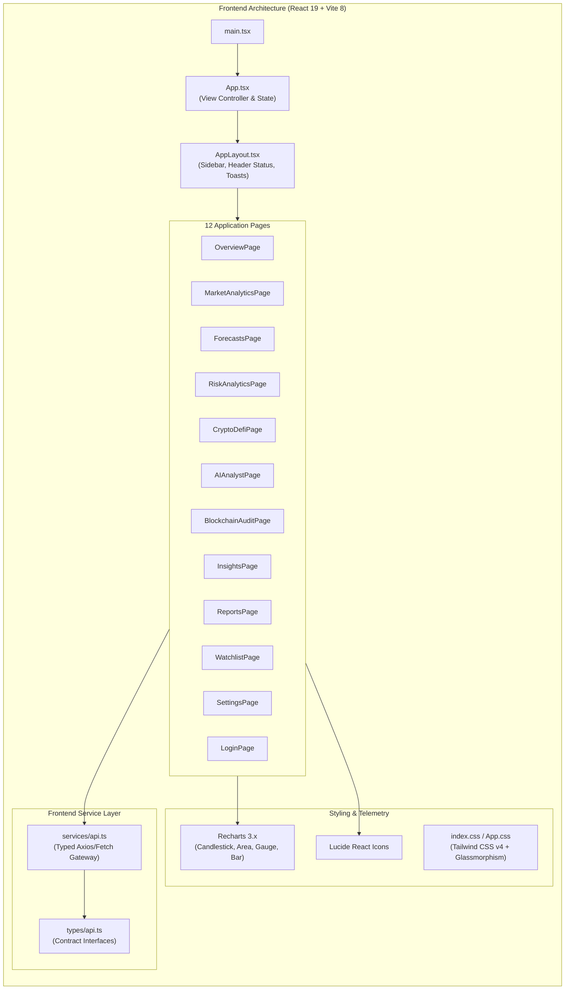
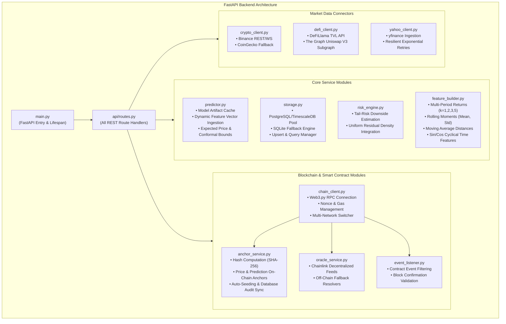
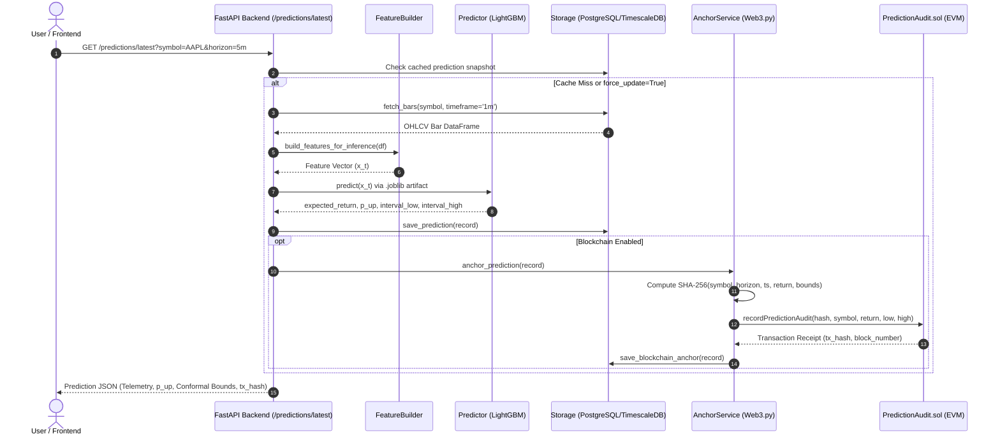
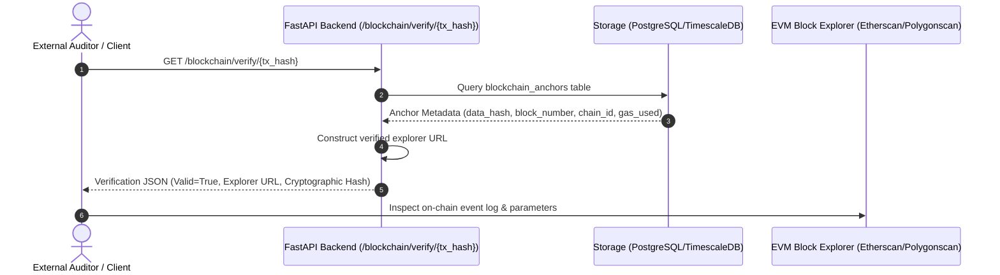
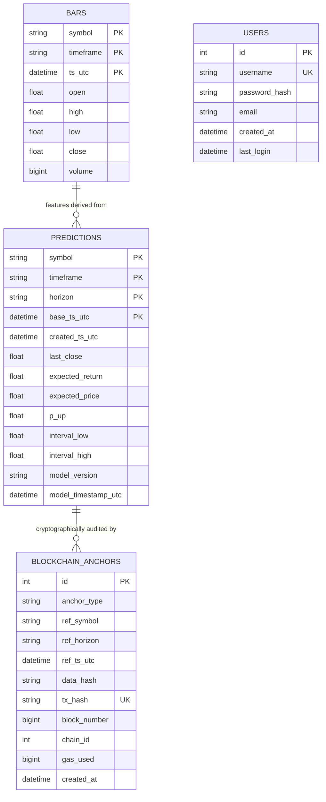

# Aegis Analytics AI System — Architecture Specification & Graph

---

## 🏛️ 1. High-Level System Overview

```mermaid
graph TB
    subgraph CLIENT_LAYER["🖥️ Client & Presentation Layer"]
        FE["React 19 + TypeScript + Vite 8\nTailwind CSS v4 · Recharts · Lucide\n(12 Dedicated Application Pages)"]
        DASH["Streamlit Dashboard\nGlassmorphism Theme · Plotly Charts\nEmbedded AI Assistant"]
    end

    subgraph BACKEND_LAYER["⚙️ Backend & API Layer (FastAPI / Python 3.10+)"]
        API["FastAPI Router\n/api/routes.py · /api/index.py"]
        CORE["Core Module\nconfig.py · types.py"]
        
        subgraph SERVICES["Business Logic & Integration Services"]
            PRED["Predictor Engine\n(In-Memory Artifacts)"]
            STORE["Storage Manager\n(PostgreSQL / TimescaleDB / SQLite)"]
            CRYPTO_S["Crypto Client\n(Binance REST/WS + CoinGecko)"]
            DEFI_S["DeFi Client\n(DeFiLlama TVL + Uniswap The Graph)"]
            YAHOO_S["Yahoo Client\n(OHLCV Resilient Ingestion)"]
        end

        subgraph ML_INTEGRATION["Machine Learning & Risk Core"]
            FEAT["Feature Builder\n(Vectorized Returns & Cyclical Encodings)"]
            RISK["Risk Engine\n(Downside Tail Risk & Conformal Bounds)"]
        end

        subgraph BLOCKCHAIN_LAYER["⛓️ Web3 & Blockchain Engine"]
            ORACLE_SVC["Oracle Service\n(Chainlink Price Feeds)"]
            ANCHOR_SVC["Anchor Service\n(Cryptographic SHA-256 Hashing)"]
            CHAIN_CLI["Chain Client\n(Web3.py Connection Manager)"]
            EVT_LST["Event Listener\n(On-Chain Event Polling)"]
        end
    end

    subgraph ML_LAYER["🤖 Machine Learning Pipeline"]
        TRAIN_CLI["Training Pipeline CLI\n(ml/train.py)"]
        LGBM_HEADS["Dual-Head LightGBM\n(Regressor + Classifier)"]
        CALIB["Isotonic Probability Calibrator\n(p_up Calibration)"]
        CONF["Conformal Residual Quantiles\n(90% Coverage Bounds)"]
    end

    subgraph SMART_CONTRACTS["📜 Smart Contracts (Solidity 0.8.20 / Hardhat)"]
        PA_CONTRACT["PredictionAudit.sol\n(Immutable Forecast Anchoring)"]
        PRC_CONTRACT["PriceAnchor.sol\n(Historical OHLCV Integrity)"]
    end

    subgraph DATA_LAYER["🗄️ Persistence & Storage Layer"]
        PG_DB[("PostgreSQL 16 + TimescaleDB\nHypertables for OHLCV & Anchors\nAlembic Migrations")]
        SQLITE_DB[("SQLite Local Fallback\ndata/app.db · dashboard_users.db")]
        MODEL_STORE[("Model Artifacts Store\nmodels/*.joblib")]
    end

    subgraph EXTERNAL_PROVIDERS["🌐 External Data & Network Feeds"]
        YAHOO_API["Yahoo Finance API\n(Equities & Indices)"]
        BINANCE_API["Binance API\n(Crypto Spot OHLCV)"]
        COINGECKO_API["CoinGecko API\n(Market Cap & Fallback Prices)"]
        DEFILLAMA_API["DeFiLlama API\n(Global TVL & Protocols)"]
        THEGRAPH_API["The Graph Subgraphs\n(Uniswap V3 Pools)"]
        EVM_NODES["EVM RPC Nodes\n(Sepolia · Polygon · Localhost)"]
    end

    %% Client Interactions
    FE -- "REST JSON HTTP" --> API
    DASH -- "REST JSON HTTP" --> API

    %% Backend Routing
    API --> CORE
    API --> SERVICES
    API --> ML_INTEGRATION
    API --> BLOCKCHAIN_LAYER

    %% Service Connections
    PRED --> MODEL_STORE
    PRED --> FEAT
    PRED --> STORE
    STORE --> PG_DB
    STORE --> SQLITE_DB
    YAHOO_S --> YAHOO_API
    CRYPTO_S --> BINANCE_API
    CRYPTO_S --> COINGECKO_API
    DEFI_S --> DEFILLAMA_API
    DEFI_S --> THEGRAPH_API

    %% ML Engine Links
    TRAIN_CLI --> FEAT
    TRAIN_CLI --> LGBM_HEADS
    LGBM_HEADS --> CALIB
    LGBM_HEADS --> CONF
    CALIB & CONF --> MODEL_STORE
    RISK --> CONF

    %% Blockchain Engine Links
    CHAIN_CLI --> EVM_NODES
    ANCHOR_SVC --> CHAIN_CLI
    ANCHOR_SVC --> PRC_CONTRACT
    ANCHOR_SVC --> PA_CONTRACT
    ORACLE_SVC --> CHAIN_CLI
    EVT_LST --> CHAIN_CLI
```

---

## 💻 2. Frontend Application Architecture (React 19 + TypeScript + Vite)

---

## ⚙️ 3. Backend & Blockchain Service Architecture

---

## 🔄 4. Data Flow & Execution Sequences

### A. Prediction Ingestion & Cryptographic On-Chain Anchoring

### B. On-Chain Cryptographic Verification Workflow

---

## 🗄️ 5. Database & Migration Schema Architecture

---

## 📊 6. Technology Stack Matrix

| Layer | Primary Technology | Key Packages & Versions | Purpose & Capabilities |
| :--- | :--- | :--- | :--- |
| **Frontend SPA** | React 19 + TypeScript 6 + Vite 8 | `react: ^19.2.8`, `typescript: ~6.0.2`, `vite: ^8.2.0`, `tailwindcss: ^4.3.3`, `recharts: ^3.10.1`, `lucide-react: ^1.31.0`, `oxlint: ^1.75.0` | 12 dedicated financial analytics pages, real-time charts, glassmorphic dark design system |
| **Backend REST API** | FastAPI + Uvicorn | `fastapi`, `uvicorn[standard]`, `pydantic`, `pydantic-settings`, `httpx` | High-throughput asynchronous REST API serving predictions, risk, market data, and Web3 endpoints |
| **Machine Learning** | LightGBM + Scikit-Learn | `lightgbm`, `scikit-learn`, `joblib`, `numpy`, `pandas` | Dual-head regression and classification, Isotonic probability calibration, Conformal prediction bounds |
| **Smart Contracts** | Solidity 0.8.20 + Hardhat | `@nomicfoundation/hardhat-toolbox`, `dotenv` | `PriceAnchor.sol` and `PredictionAudit.sol` for immutable on-chain data verification |
| **Web3 Client** | Web3.py + Eth-Account | `web3>=6.15.0`, `eth-account>=0.10.0`, `hexbytes>=0.3.0` | Transaction signing, smart contract interaction, event polling, Chainlink price feed queries |
| **Database & ORM** | PostgreSQL 16 + TimescaleDB | `psycopg2-binary>=2.9.9`, `asyncpg>=0.29.0`, `alembic>=1.13.0`, `sqlalchemy` | High-performance time-series hypertables, Alembic schema migrations, SQLite fallback |
| **Crypto & DeFi Data** | Binance + CoinGecko + DeFiLlama | `python-binance>=1.0.19`, `pycoingecko>=3.1.0`, The Graph Uniswap Subgraph | Multi-asset crypto spot OHLCV, protocol Total Value Locked (TVL), decentralized liquidity pool metrics |
| **Dashboard** | Streamlit + Plotly | `streamlit`, `plotly` | Standalone interactive quantitative dashboard, AI Assistant, and user management store |
| **DevOps & Infra** | Docker Compose + PowerShell | `docker-compose.yml`, PowerShell scripts (`scripts/`) | Containerized deployment of API, TimescaleDB, and Streamlit with automated restart/health scripts |
