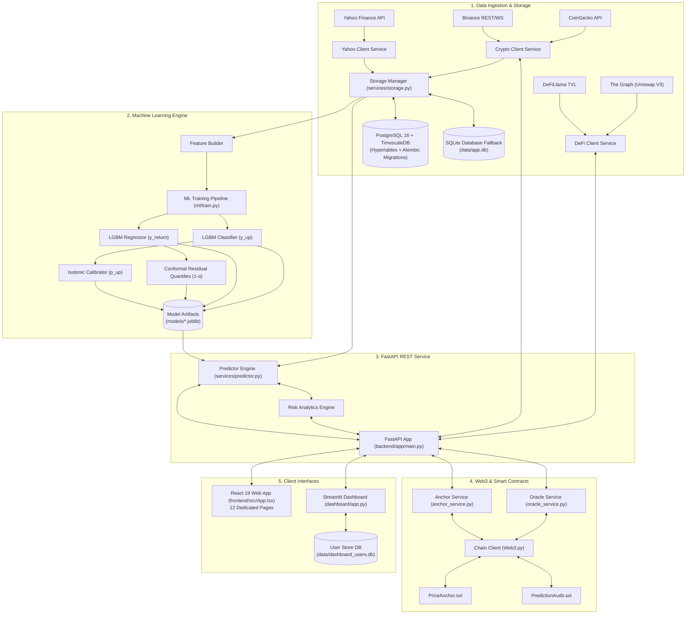

# Aegis Analytics AI — Project Brain & Knowledge Base

> **System Knowledge & Architecture Blueprint**  
> This `brain.md` file serves as the centralized structural map, technical reference, and operational context guide for **Aegis Analytics AI**.

---

## 💡 System Overview

**Aegis Analytics AI** is an enterprise-grade quantitative market intelligence and decentralized audit platform designed for asset return forecasting, directional confidence estimation, distribution-free statistical risk quantification, and cryptographic on-chain verification across equities, crypto, and DeFi assets.

### Core Capabilities & Highlights
* **Multi-Asset Ingestion**: Real-time and historical bar retrieval for equities (Yahoo Finance), cryptocurrency spot pairs (Binance REST/WebSocket & CoinGecko), and decentralized finance metrics (DeFiLlama TVL & Uniswap V3 via The Graph).
* **Feature Engineering**: Vectorized technical return features, rolling statistical moments, moving-average trend ratios, and continuous cyclical sine/cosine timestamp transformations.
* **Dual-Head Machine Learning**: Ensemble Gradient Boosted Decision Trees (LightGBM) trained simultaneously for continuous expected return regression ($\hat{y}_{\text{return}}$) and binary directional classification ($y_{\text{up}}$).
* **Mathematical Confidence & Risk**:
  * **Isotonic Probability Calibration**: Refines raw tree probability outputs into true, calibrated directional confidence ($p_{\text{up}}$).
  * **Conformal Prediction Intervals**: Computes empirical absolute residual quantiles to guarantee distribution-free finite-sample statistical coverage at $(1 - \alpha)$ confidence (default 90%).
  * **Downside Tail-Risk Analytics**: Mathematical derivation of downside event probabilities ($P(\text{Return} < -1\%)$ and $P(\text{Return} < -2\%)$) from conformal error distributions.
* **Web3 & Blockchain Audit Trail**:
  * Solidity smart contracts (`PriceAnchor.sol` and `PredictionAudit.sol`) deployed via Hardhat to EVM networks (Sepolia, Polygon, Localhost).
  * Cryptographic SHA-256 hash anchoring of historical prices and model predictions for verifiable auditability.
  * Chainlink decentralized price oracle integration and block explorer verification links.
* **Presentation Layer**:
  * **React 19 SPA**: Modern single-page application built with React 19, TypeScript 6, Vite 8, Tailwind CSS v4, Recharts 3, and Lucide React featuring 12 dedicated analytical pages.
  * **Streamlit Dashboard**: Glassmorphic financial dashboard with Plotly candlestick charts, interactive risk gauges, and an embedded AI Market Assistant.
* **Enterprise Persistence**: PostgreSQL 16 with TimescaleDB hypertables, Alembic schema migrations, and a zero-configuration SQLite local development fallback.

---

## 🏗️ System Architecture & Data Flow



---

## 📁 Repository Directory Map

Below is the structured layout of all project components and their responsibilities:

| Directory / File | Core Responsibility / Purpose |
| :--- | :--- |
| [`backend/app/main.py`](file:///c:/Users/Asus/Desktop/project_type_02/backend/app/main.py) | FastAPI app entry point, lifespan event handlers, CORS configuration |
| [`backend/app/api/routes.py`](file:///c:/Users/Asus/Desktop/project_type_02/backend/app/api/routes.py) | Complete REST API endpoint routing (market data, ML predictions, risk, auth, blockchain, oracle, crypto, defi) |
| [`backend/app/api/index.py`](file:///c:/Users/Asus/Desktop/project_type_02/backend/app/api/index.py) | Endpoint index catalog definition |
| [`backend/app/core/config.py`](file:///c:/Users/Asus/Desktop/project_type_02/backend/app/core/config.py) | Application settings dataclass, environment variable loader, model horizons & database URLs |
| [`backend/app/core/types.py`](file:///c:/Users/Asus/Desktop/project_type_02/backend/app/core/types.py) | Pydantic request & response validation schemas for API contracts |
| [`backend/app/features/feature_builder.py`](file:///c:/Users/Asus/Desktop/project_type_02/backend/app/features/feature_builder.py) | Vectorized technical return features, rolling moments, trend ratios, and cyclical time encodings |
| [`backend/app/services/predictor.py`](file:///c:/Users/Asus/Desktop/project_type_02/backend/app/services/predictor.py) | In-memory model artifact loader, dynamic inference pipeline, and prediction snapshot logger |
| [`backend/app/services/storage.py`](file:///c:/Users/Asus/Desktop/project_type_02/backend/app/services/storage.py) | SQLAlchemy ORM models (`Bar`, `Prediction`, `BlockchainAnchor`) and database CRUD manager |
| [`backend/app/services/yahoo_client.py`](file:///c:/Users/Asus/Desktop/project_type_02/backend/app/services/yahoo_client.py) | Yahoo Finance market data client with retry handling |
| [`backend/app/services/crypto_client.py`](file:///c:/Users/Asus/Desktop/project_type_02/backend/app/services/crypto_client.py) | Binance REST/WebSocket client and CoinGecko market price fetcher |
| [`backend/app/services/defi_client.py`](file:///c:/Users/Asus/Desktop/project_type_02/backend/app/services/defi_client.py) | DeFiLlama protocol TVL client and The Graph Uniswap V3 liquidity pool fetcher |
| [`backend/app/blockchain/anchor_service.py`](file:///c:/Users/Asus/Desktop/project_type_02/backend/app/blockchain/anchor_service.py) | SHA-256 price/prediction hashing and smart contract transaction anchoring |
| [`backend/app/blockchain/chain_client.py`](file:///c:/Users/Asus/Desktop/project_type_02/backend/app/blockchain/chain_client.py) | Web3.py RPC node connection manager, wallet signing, and multi-network switcher |
| [`backend/app/blockchain/oracle_service.py`](file:///c:/Users/Asus/Desktop/project_type_02/backend/app/blockchain/oracle_service.py) | Chainlink decentralized oracle price client with off-chain fallbacks |
| [`backend/app/blockchain/event_listener.py`](file:///c:/Users/Asus/Desktop/project_type_02/backend/app/blockchain/event_listener.py) | On-chain contract event filter and confirmation tracker |
| [`backend/app/db/migrations/`](file:///c:/Users/Asus/Desktop/project_type_02/backend/app/db/migrations) | Alembic versioned migrations (`001_init_bars_predictions.py`, `002_add_blockchain_tables.py`) |
| [`backend/app/risk/risk_engine.py`](file:///c:/Users/Asus/Desktop/project_type_02/backend/app/risk/risk_engine.py) | Downside tail-risk probability calculator from conformal prediction bounds |
| [`contracts/PredictionAudit.sol`](file:///c:/Users/Asus/Desktop/project_type_02/contracts/PredictionAudit.sol) | Solidity smart contract for immutable on-chain forecast anchoring |
| [`contracts/PriceAnchor.sol`](file:///c:/Users/Asus/Desktop/project_type_02/contracts/PriceAnchor.sol) | Solidity smart contract for immutable on-chain price bar anchoring |
| [`frontend/`](file:///c:/Users/Asus/Desktop/project_type_02/frontend) | React 19 + TypeScript 6 + Vite 8 + Tailwind CSS v4 Web Application |
| [`frontend/src/pages/`](file:///c:/Users/Asus/Desktop/project_type_02/frontend/src/pages) | 12 application pages (Overview, Market, Forecasts, Risk, Crypto/DeFi, AI Analyst, Blockchain, etc.) |
| [`frontend/src/layouts/AppLayout.tsx`](file:///c:/Users/Asus/Desktop/project_type_02/frontend/src/layouts/AppLayout.tsx) | Responsive navigation sidebar, header network status, and toast provider |
| [`frontend/src/services/api.ts`](file:///c:/Users/Asus/Desktop/project_type_02/frontend/src/services/api.ts) | Frontend API client communicating with FastAPI backend |
| [`ml/train.py`](file:///c:/Users/Asus/Desktop/project_type_02/ml/train.py) | Multi-symbol, multi-horizon model training CLI script |
| [`ml/training/train_pipeline.py`](file:///c:/Users/Asus/Desktop/project_type_02/ml/training/train_pipeline.py) | Core training pipeline with chronological train/calibration splits and joblib exporter |
| [`ml/confidence/calibration.py`](file:///c:/Users/Asus/Desktop/project_type_02/ml/confidence/calibration.py) | Isotonic probability calibration for directional classification outputs |
| [`ml/confidence/conformal_intervals.py`](file:///c:/Users/Asus/Desktop/project_type_02/ml/confidence/conformal_intervals.py) | Conformal residual quantile estimation for predictive uncertainty bounds |
| [`dashboard/app.py`](file:///c:/Users/Asus/Desktop/project_type_02/dashboard/app.py) | Streamlit dashboard entry point with dark glassmorphic styling and Plotly charts |
| [`dashboard/assistant.py`](file:///c:/Users/Asus/Desktop/project_type_02/dashboard/assistant.py) | Embedded AI Assistant module for quantitative market queries |
| [`dashboard/theme.py`](file:///c:/Users/Asus/Desktop/project_type_02/dashboard/theme.py) | CSS design system tokens, layout styling, and Plotly theme configurations |
| [`dashboard/user_store.py`](file:///c:/Users/Asus/Desktop/project_type_02/dashboard/user_store.py) | SQLite authentication, password hashing, and user watchlist persistence |
| [`scripts/`](file:///c:/Users/Asus/Desktop/project_type_02/scripts) | PowerShell helper scripts (`start_api.ps1`, `start_dashboard.ps1`, `restart.ps1`, `deploy.ps1`, `health_check.ps1`) |
| [`docker-compose.yml`](file:///c:/Users/Asus/Desktop/project_type_02/docker-compose.yml) | Multi-container setup for PostgreSQL/TimescaleDB, FastAPI, and Streamlit |
| [`hardhat.config.js`](file:///c:/Users/Asus/Desktop/project_type_02/hardhat.config.js) | Hardhat configuration for Solidity 0.8.20 and multi-chain EVM deployment |

---

## 🔬 Mathematical & Machine Learning Foundations

### 1. Dual-Head Learning Architecture
- **Expected Return Regressor**: Fits $y_{\text{return}} = \frac{P_{t+h} - P_t}{P_t}$ to output continuous expected percentage return $\hat{y}$.
- **Directional Classifier**: Fits $y_{\text{up}} = \mathbb{I}(y_{\text{return}} > 0)$ to output raw classification tree probability $p_{\text{raw}}$.

### 2. Probability Calibration
Raw classification tree probabilities are passed through an `IsotonicRegression` mapping fitted on the chronological calibration set:
$$p_{\text{up}} = \text{IsotonicFit}(p_{\text{raw}})$$

### 3. Conformal Prediction Bounds
Given calibration set absolute residuals $R_i = |y_i - \hat{y}_i|$, the quantile $q_{(1-\alpha)}$ is evaluated (default $\alpha=0.10$ for 90% confidence):
$$\text{Interval} = [\hat{y} - q_{(1-\alpha)}, \; \hat{y} + q_{(1-\alpha)}]$$
Converted to price space:
$$\text{Price Bounds} = [P_t \times (1 + \text{Low}), \; P_t \times (1 + \text{High})]$$

### 4. Downside Tail Risk
Assuming a uniform distribution density over $[\text{Low}, \text{High}]$, downside tail risk for thresholds $T \in \{-0.01, -0.02\}$ is:
$$P(\text{Return} < T) = \text{clamp}\left(\frac{T - \text{Low}}{\text{High} - \text{Low}}, \, 0.0, \, 1.0\right)$$

---

## ⚡ Operational Quickstart & CLI Commands

### 1. Model Training
Train ML models across standard intraday (5m, 15m, 60m) and daily (1d) horizons:
```bash
python -m ml.train --symbols RELIANCE.NS,INFY.NS,TCS.NS,AAPL,MSFT
```

### 2. Start FastAPI REST Backend
Run the backend server on port 8000:
```bash
python -m uvicorn backend.app.main:app --host 127.0.0.1 --port 8000
```
Or via PowerShell script:
```powershell
.\scripts\start_api.ps1
```

### 3. Start React 19 Frontend Web App
Launch the modern React SPA:
```bash
cd frontend
npm run dev
```

### 4. Start Streamlit Dashboard
Launch the interactive Streamlit interface:
```powershell
.\scripts\start_dashboard.ps1
```

### 5. Docker Compose Launch
Run PostgreSQL/TimescaleDB, FastAPI, and Streamlit in orchestrated containers:
```bash
docker-compose up -d
```

### 6. System Health Check & Restart
Run diagnostics or clean stale background processes:
```powershell
.\scripts\health_check.ps1
.\scripts\restart.ps1
```

---

## 📝 Key Database Schemas

### Price Bars (`bars` table in PostgreSQL / SQLite)
- `symbol` (String, PK): Market ticker (e.g. `AAPL`, `RELIANCE.NS`)
- `timeframe` (String, PK): Bar resolution (`1m`, `1d`)
- `ts_utc` (DateTime, PK): Bar timestamp in UTC
- `open`, `high`, `low`, `close` (Float): Price OHLC values
- `volume` (BigInteger): Bar volume

### Prediction Snapshots (`predictions` table)
- `symbol` (String, PK), `timeframe` (String, PK), `horizon` (String, PK)
- `base_ts_utc` (DateTime, PK): Timestamp of price bar used for prediction
- `created_ts_utc` (DateTime): Timestamp when prediction was generated
- `last_close` (Float): Price at time of inference
- `expected_return` (Float): Predicted return percentage ($\hat{y}$)
- `expected_price` (Float): Predicted future price
- `p_up` (Float): Calibrated directional confidence
- `interval_low`, `interval_high` (Float): Conformal error bounds
- `model_version`, `model_timestamp_utc`

### Blockchain Anchors (`blockchain_anchors` table)
- `id` (Integer, PK, Auto-increment)
- `anchor_type` (String): `'price'` or `'prediction'`
- `ref_symbol` (String), `ref_horizon` (String), `ref_ts_utc` (DateTime)
- `data_hash` (String): SHA-256 cryptographic hash (0x + 64 hex characters)
- `tx_hash` (String, Unique): EVM transaction hash
- `block_number` (BigInteger), `chain_id` (Integer), `gas_used` (BigInteger)
- `created_at` (DateTime)

---

## 🛠️ Developer Rules & Guidelines

> [!IMPORTANT]
> **Working Directory**: Always execute commands from the **project root directory** (`c:\Users\Asus\Desktop\project_type_02`).

> [!TIP]
> **Trained Model Prerequisite**: REST endpoints `/predictions/latest` and `/risk/latest` require pre-trained model artifacts (`models/*.joblib`). If missing, train symbols using `python -m ml.train --symbols <TICKERS>`.

> [!WARNING]
> **Port Conflicts (WinError 10048)**: If port 8000 is occupied, execute `.\scripts\restart.ps1` to terminate orphaned Python background processes cleanly.
