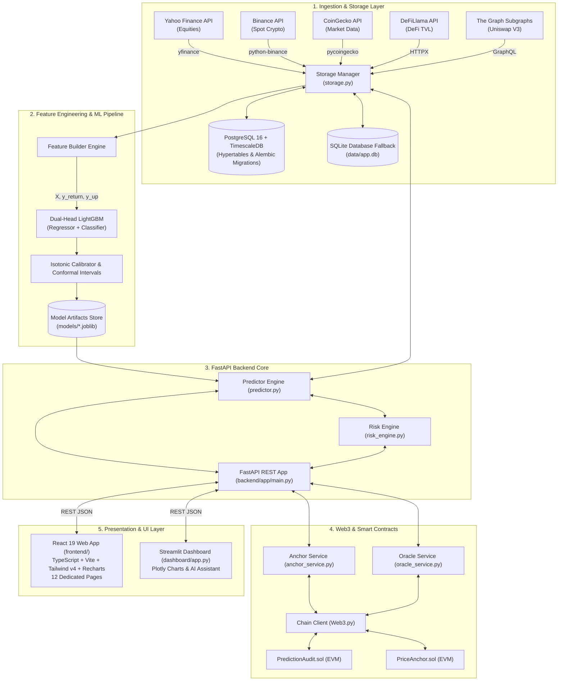

# Aegis Analytics AI — Complete System Documentation

**Aegis Analytics AI** is an enterprise-grade quantitative market intelligence, machine learning forecasting, and decentralized cryptographic audit platform. It ingests multi-asset price and market data (traditional equities, crypto spot markets, and decentralized finance protocols), builds statistical and technical features, trains dual-head machine learning models to forecast asset returns and directions, quantifies downside risks using conformal prediction intervals, cryptographically anchors predictions on EVM blockchains, and exposes interactive insights via a **React 19 single-page application**, a **Streamlit visual dashboard**, and a high-performance **FastAPI REST backend**.

---

## 🏗️ 1. System Architecture Overview



---

## 📁 2. Repository Layout & File Map

| Path | Description |
| :--- | :--- |
| `README.md` | Master project README, high-level architecture, quickstart commands, and API endpoint tables. |
| `PROJECT.md` | Definitive technical specification and engineering blueprint. |
| `architecture.md` | Visual architectural diagrams, sequence workflows, and component interaction graphs. |
| `brain.md` | Project knowledge base, directory reference, database schemas, and developer rules. |
| `requirements.txt` | Python dependencies (`fastapi`, `streamlit`, `lightgbm`, `scikit-learn`, `yfinance`, `sqlalchemy`, `psycopg2-binary`, `alembic`, `web3`, `python-binance`, `pycoingecko`, `httpx`, `plotly`, `pydantic`). |
| `hardhat.config.js` | Hardhat EVM network configuration for Solidity 0.8.20 contracts (Sepolia, Polygon, Localhost). |
| `docker-compose.yml` | Multi-container setup for PostgreSQL 16 + TimescaleDB, FastAPI backend, and Streamlit dashboard. |
| `backend/app/main.py` | FastAPI application entry point, lifespan initialization, and CORS middleware. |
| `backend/app/core/config.py` | Configuration settings dataclass and environment variable resolver. |
| `backend/app/core/types.py` | Pydantic data schemas for API requests, responses, and validation. |
| `backend/app/api/routes.py` | Complete REST API endpoint routing (market data, ML predictions, risk, auth, blockchain, oracle, crypto, defi). |
| `backend/app/api/index.py` | Route catalog index helper. |
| `backend/app/db/migrations/` | Alembic database migration scripts (`001_init_bars_predictions.py`, `002_add_blockchain_tables.py`). |
| `backend/app/features/feature_builder.py` | Vectorized technical return features, rolling statistical moments, and continuous cyclical time encodings. |
| `backend/app/services/predictor.py` | In-memory model artifact loader and real-time inference pipeline. |
| `backend/app/services/storage.py` | SQLAlchemy ORM models (`BarORM`, `PredictionORM`, `BlockchainAnchorORM`) and database CRUD methods. |
| `backend/app/services/yahoo_client.py` | Yahoo Finance market data fetcher with exponential retries. |
| `backend/app/services/crypto_client.py` | Binance REST/WebSocket client and CoinGecko market price fetcher. |
| `backend/app/services/defi_client.py` | DeFiLlama protocol TVL client and The Graph Uniswap V3 liquidity pool fetcher. |
| `backend/app/blockchain/anchor_service.py` | Cryptographic SHA-256 price/prediction hashing and on-chain transaction anchoring. |
| `backend/app/blockchain/chain_client.py` | Web3.py RPC node connection manager, wallet signing, and multi-network switcher. |
| `backend/app/blockchain/oracle_service.py` | Chainlink decentralized oracle price client with off-chain fallbacks. |
| `backend/app/blockchain/event_listener.py` | On-chain contract event filter and confirmation tracker. |
| `backend/app/risk/risk_engine.py` | Downside tail-risk probability calculator evaluating prediction bounds. |
| `contracts/PredictionAudit.sol` | Solidity smart contract for immutable on-chain forecast anchoring. |
| `contracts/PriceAnchor.sol` | Solidity smart contract for immutable on-chain price bar anchoring. |
| `frontend/` | React 19 + TypeScript 6 + Vite 8 + Tailwind CSS v4 + Recharts 3 single-page web application. |
| `frontend/src/pages/` | 12 dedicated application pages (Overview, Market Analytics, Forecasts, Risk, Crypto/DeFi, AI Analyst, Blockchain Audit, etc.). |
| `frontend/src/layouts/AppLayout.tsx` | Responsive navigation sidebar shell and network status monitor. |
| `frontend/src/services/api.ts` | Typed frontend API gateway targeting FastAPI backend endpoints. |
| `ml/train.py` | Multi-symbol, multi-horizon model training CLI script. |
| `ml/training/train_pipeline.py` | Core training pipeline with chronological train/calibration splits and joblib exporter. |
| `ml/confidence/calibration.py` | Isotonic probability calibration for directional classification outputs. |
| `ml/confidence/conformal_intervals.py` | Conformal residual quantile estimation for predictive uncertainty bounds. |
| `dashboard/app.py` | Streamlit financial dashboard with dark glassmorphic styling and Plotly charts. |
| `dashboard/assistant.py` | Embedded AI Assistant module for quantitative market queries. |
| `dashboard/theme.py` | Custom CSS design system tokens, layout styling, and Plotly theme configurations. |
| `dashboard/user_store.py` | SQLite authentication, password hashing, and user watchlist persistence. |
| `scripts/` | PowerShell operational scripts (`start_api.ps1`, `start_dashboard.ps1`, `restart.ps1`, `health_check.ps1`, `deploy.ps1`, `update_repo.ps1`). |

---

## 🛠️ 3. Technology Stack Matrix

| Layer | Technologies & Libraries |
| :--- | :--- |
| **Frontend SPA** | React 19 (`^19.2.8`), TypeScript 6 (`~6.0.2`), Vite 8 (`^8.2.0`), Tailwind CSS v4 (`^4.3.3`), Recharts (`^3.10.1`), Lucide React (`^1.31.0`), Oxlint (`^1.75.0`) |
| **Backend REST API** | FastAPI, Uvicorn, Pydantic v2, Pydantic-Settings, HTTPX, Tenacity, Python 3.10+ |
| **Machine Learning** | LightGBM (`LGBMRegressor`, `LGBMClassifier`), Scikit-Learn (`IsotonicRegression`), Pandas, NumPy, Joblib |
| **Smart Contracts & Web3** | Solidity 0.8.20, Hardhat, Web3.py (`>=6.15.0`), Eth-Account (`>=0.10.0`), Hexbytes, Sepolia, Polygon |
| **Database & Persistence** | PostgreSQL 16 + TimescaleDB (Hypertables), Alembic (`>=1.13.0`), SQLAlchemy 2.0, SQLite (Local Dev Fallback) |
| **Market Data Providers** | Yahoo Finance (`yfinance`), Binance (`python-binance`), CoinGecko (`pycoingecko`), DeFiLlama, The Graph |
| **Alternative Dashboard** | Streamlit, Plotly |
| **DevOps & Orchestration** | Docker Compose (`docker-compose.yml`), PowerShell Automation Scripts (`scripts/`) |

---

## 💡 4. Deep-Dive Component Architecture

### A. Data Ingestion & Storage
- **Equities Ingestion**: `backend/app/services/yahoo_client.py` retrieves historical and real-time OHLCV bars with automatic duplicate stripping and UTC timezone normalization.
- **Crypto Ingestion**: `backend/app/services/crypto_client.py` connects to Binance spot endpoints and CoinGecko API for cryptocurrency pairs (`BTCUSDT`, `ETHUSDT`, `SOLUSDT`, etc.).
- **DeFi Analytics**: `backend/app/services/defi_client.py` integrates DeFiLlama for protocol TVL metrics and The Graph for Uniswap V3 liquidity pool data.
- **Storage Engine**: `backend/app/services/storage.py` manages connections to PostgreSQL 16 / TimescaleDB with automatic SQLite fallback (`data/app.db`).

### B. Feature Engineering (`backend/app/features/feature_builder.py`)
For each price bar timestamp $t$, the engine computes:
- **Price Returns**: 1-bar, 2-bar, 3-bar, and 5-bar percentage returns ($\text{ret}_k = \frac{P_t - P_{t-k}}{P_{t-k}}$).
- **Rolling Statistics**: Rolling mean $\mu_{\text{ret}}$ and standard deviation $\sigma_{\text{ret}}$ over windows (5, 15, 30 bars for 1m intraday; 5, 10, 20 bars for 1d daily).
- **Moving Average Distances**: Distance of current price to rolling moving average ($\text{trend\_ma}_w = \frac{P_t}{MA_w(t)} - 1$).
- **Cyclical Time Encoding**: Sine and cosine projections for `hour` (period 24), `minute` (period 60), and `dayofweek` (period 7).

### C. Machine Learning Pipeline (`ml/training/train_pipeline.py`)
For each symbol and forecast horizon (`5m`, `15m`, `60m`, `1d`):
1. **Target Construction**:
   - Continuous return target: $y_{\text{return}} = \frac{P_{t+k} - P_t}{P_t}$
   - Binary direction target: $y_{\text{up}} = \mathbb{I}(y_{\text{return}} > 0)$
2. **Model Training**:
   - `LGBMRegressor`: Fits continuous expected return $\hat{y}_{\text{return}}$.
   - `LGBMClassifier`: Fits raw directional probability $p_{\text{raw}}$.
3. **Probability Calibration**: Uses `IsotonicRegression` on calibration data (`ml/confidence/calibration.py`) to output calibrated directional probability $p_{\text{up}}$.
4. **Conformal Prediction Intervals**: Computes residual bounds $q_{1-\alpha} = \text{Quantile}(|y_{\text{true}} - \hat{y}|, 1 - \alpha)$ (`ml/confidence/conformal_intervals.py`) guaranteeing $(1-\alpha)$ coverage confidence bounds:
   $$\text{Interval} = [\hat{y} - q_{1-\alpha}, \; \hat{y} + q_{1-\alpha}]$$
5. **Artifact Persistence**: Serializes trained components into `models/<SYMBOL>_<TIMEFRAME>_<HORIZON>_mvp_v1.joblib`.

### D. Blockchain & Smart Contract Audit Layer (`backend/app/blockchain/`)
- **Price Anchoring**: Generates SHA-256 state hashes of OHLCV bars and records them via `PriceAnchor.sol`.
- **Prediction Auditing**: Anchors model forecasts (expected return, target price, conformal bounds) via `PredictionAudit.sol` before price discovery occurs.
- **Oracle Feeds**: Integrates Chainlink AggregatorV3 contracts for decentralized asset pricing.

### E. REST API Server (`backend/app/api/routes.py`)
High-throughput FastAPI server running on `http://127.0.0.1:8000`:
- **Market Data**: `GET /bars/recent`, `GET /crypto/bars/recent`, `GET /crypto/symbols`
- **ML Forecasts**: `GET /predictions/latest`, `GET /risk/latest`, `GET /meta/symbols`
- **DeFi Metrics**: `GET /defi/protocols`, `GET /defi/tvl/{protocol}`, `GET /defi/global`, `GET /defi/uniswap/pools`
- **Blockchain & Oracles**: `GET /blockchain/status`, `GET /blockchain/anchors/{symbol}`, `GET /blockchain/verify/{tx_hash}`, `POST /blockchain/anchor-prediction`, `GET /oracle/prices/{pair}`
- **Authentication**: `POST /auth/login`, `POST /auth/register`

### F. React 19 Frontend Web Application (`frontend/`)
Running on `http://localhost:5173`:
- **12 Dedicated Pages**: `Overview`, `MarketAnalytics`, `Forecasts`, `RiskAnalytics`, `CryptoDefi`, `AIAnalyst`, `BlockchainAudit`, `Insights`, `Reports`, `Watchlist`, `Settings`, `Login`.
- **Design System**: Glassmorphic dark styling, Tailwind CSS v4, dynamic Recharts 3 data visualizations, Lucide React iconography.

### G. Streamlit Visual Dashboard (`dashboard/app.py`)
Running on `http://localhost:8501`:
- Plotly interactive candlestick charts, multi-horizon comparison cards, automated trading advice rules (*Buy*, *Hold*, *Sell/Reduce*), user authentication store, and embedded AI Assistant.

---

## ⚙️ 5. Configuration & Environment Variables

| Variable | Role | Default Value |
| :--- | :--- | :--- |
| `SYMBOLS` | Default equity ticker list | `RELIANCE.NS,INFY.NS,TCS.NS` |
| `DATABASE_URL` | PostgreSQL connection URL | `sqlite:///data/app.db` |
| `DATA_DB_PATH` | Fallback SQLite database path | `data/app.db` |
| `MODEL_DIR` | Directory containing `.joblib` model files | `models` |
| `INTRADAY_INTERVAL` | Yahoo interval for intraday bars | `1m` |
| `INTRADAY_LOOKBACK_DAYS` | Intraday history lookback window in days | `7` |
| `DAILY_HORIZON_DAYS` | Daily horizon label in days | `1` |
| `CONFORMAL_ALPHA` | Miscoverage alpha for conformal intervals | `0.1` (90% confidence) |
| `BLOCKCHAIN_ENABLED` | Feature flag for Web3 on-chain anchoring | `false` |
| `CHAIN_RPC_URL` | EVM RPC endpoint URL | `""` |
| `CHAIN_ID` | EVM Chain ID | `11155111` (Sepolia) |
| `WALLET_PRIVATE_KEY` | Transaction signing wallet private key | `""` |
| `PRICE_ANCHOR_CONTRACT` | Address of `PriceAnchor.sol` | `""` |
| `PREDICTION_AUDIT_CONTRACT` | Address of `PredictionAudit.sol` | `""` |
| `BINANCE_API_KEY` | Binance API key | `""` |
| `COINGECKO_API_KEY` | CoinGecko API key | `""` |

---

## 🚀 6. Operational Workflows & CLI Commands

### Step 1: Install Dependencies
```powershell
# Python backend & ML dependencies
pip install -r requirements.txt

# React frontend dependencies
cd frontend
npm install
cd ..
```

### Step 2: Train Machine Learning Models
```powershell
python -m ml.train --symbols RELIANCE.NS,INFY.NS,TCS.NS,AAPL,MSFT
```

### Step 3: Launch Services

- **FastAPI Backend Server** (`http://127.0.0.1:8000`):
  ```powershell
  .\scripts\start_api.ps1
  ```

- **React 19 Web Application** (`http://localhost:5173`):
  ```powershell
  cd frontend
  npm run dev
  ```

- **Streamlit Dashboard** (`http://localhost:8501`):
  ```powershell
  .\scripts\start_dashboard.ps1
  ```

- **Docker Compose (Full Multi-Container Stack)**:
  ```powershell
  docker-compose up -d
  ```

- **Run Health Diagnostics**:
  ```powershell
  .\scripts\health_check.ps1
  ```

- **Restart / Reset Processes**:
  ```powershell
  .\scripts\restart.ps1
  ```

---
*Complete System Documentation — Aegis Analytics AI System.*
