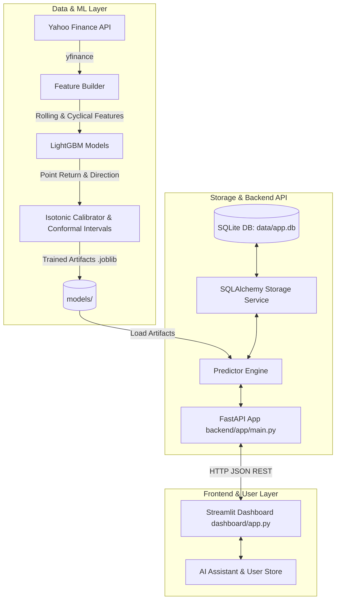

# Aegis Analytics AI — Complete System Documentation

**Aegis Analytics AI** is an end-to-end quantitative intelligence system and machine learning platform. It ingests historical and live market OHLCV (Open, High, Low, Close, Volume) price data, builds statistical and technical features, trains machine learning models to forecast future asset returns and directions, quantifies downside risks using conformal prediction intervals, and exposes this data via a **FastAPI backend** and a **Streamlit visual dashboard**.

---

## 🏗️ 1. System Architecture Overview



---

## 📁 2. Repository Layout & File Map

| Path | Description |
| :--- | :--- |
| `README.md` | High-level project documentation, quickstart steps, and API endpoint tables. |
| `requirements.txt` | Python dependencies (`fastapi`, `streamlit`, `lightgbm`, `scikit-learn`, `yfinance`, `sqlalchemy`, `plotly`, `pydantic`). |
| `backend/app/main.py` | FastAPI app entry point. Initializes SQLite DB and mounts API routes. |
| `backend/app/core/config.py` | Environment configuration and default settings (`SYMBOLS`, `DATA_DB_PATH`, `MODEL_DIR`, `CONFORMAL_ALPHA`, etc.). |
| `backend/app/api/routes.py` | REST API route definitions (`/health`, `/meta/symbols`, `/bars/recent`, `/predictions/latest`, `/risk/latest`). |
| `backend/app/features/feature_builder.py` | Technical price return features and cyclical time features (hour, minute, day-of-week sine/cosine transformations). |
| `backend/app/services/predictor.py` | Inference pipeline that loads trained model `.joblib` artifacts and computes real-time predictions. |
| `backend/app/services/storage.py` | Database ORM and persistence helper functions using SQLAlchemy and SQLite. |
| `backend/app/services/yahoo_client.py` | Yahoo Finance market data fetcher with retries and rate limit handling. |
| `backend/app/risk/risk_engine.py` | Risk analysis engine evaluating downside risk probabilities from prediction intervals. |
| `ml/train.py` | CLI training script to train models across configured symbols for 5m, 15m, 60m, and 1d horizons. |
| `ml/training/train_pipeline.py` | Training logic using LightGBM regressors and classifiers, split-by-time calibration, and saving model artifacts. |
| `ml/confidence/calibration.py` | Isotonic regression calibrator mapping raw classification probabilities to reliable directional probabilities (`p_up`). |
| `ml/confidence/conformal_intervals.py` | Conformal prediction implementation generating statistical prediction bounds at specified confidence levels (e.g. $\alpha=0.10$ for 90% confidence). |
| `dashboard/app.py` | Modern Streamlit Web UI featuring interactive candlestick charts, forecast telemetry, risk metrics, and horizon comparisons. |
| `dashboard/theme.py` | Custom UI design system, styling, glassmorphism cards, and Plotly theme overrides. |
| `dashboard/user_store.py` | Local user authentication, watchlists, user preferences, and prediction history persistence. |
| `dashboard/assistant.py` | AI assistant tab integrated into the dashboard for user queries. |
| `scripts/` | PowerShell operational scripts (`start_api.ps1`, `start_dashboard.ps1`, `restart.ps1`, `health_check.ps1`, `deploy.ps1`, `update_repo.ps1`). |

---

## 🛠️ 3. Technology Stack

| Layer | Technologies & Tools |
| :--- | :--- |
| **Runtime** | Python 3.10+ |
| **Backend API** | FastAPI, Uvicorn, Pydantic, SQLAlchemy |
| **Machine Learning** | LightGBM (`LGBMRegressor`, `LGBMClassifier`), Scikit-Learn (`IsotonicRegression`), NumPy, Pandas |
| **Market Data** | Yahoo Finance API (`yfinance`) |
| **Frontend / Dashboard** | Streamlit, Plotly, Custom HTML/CSS design system |
| **Storage** | SQLite (`data/app.db` for API market data; `data/dashboard_users.db` for user accounts) |
| **Serialization** | Joblib (`.joblib` model artifacts) |

---

## 💡 4. Deep-Dive Component Architecture

### A. Data Ingestion & Storage
- **Market Data Engine**: Market data is retrieved using `backend/app/services/yahoo_client.py`.
- **SQLite Database**: Bars and predictions are stored in `data/app.db` managed by `backend/app/services/storage.py`. Duplicate bars are handled smoothly using SQLite `ON CONFLICT DO UPDATE` upserts.

### B. Feature Engineering (`backend/app/features/feature_builder.py`)
For every bar timestamp $t$, the pipeline constructs:
- **Price Returns**: 1-bar, 2-bar, 3-bar, 5-bar percent changes ($\Delta P / P$).
- **Rolling Statistics**: Rolling return mean & standard deviation across multiple windows (5, 15, 30 bars for 1m intraday; 5, 10, 20 bars for 1d daily).
- **Moving Average Trends**: Ratio of price to rolling moving average ($P / MA - 1$).
- **Cyclical Time Encoding**: Sine and cosine features for `hour`, `minute`, and `dayofweek` to capture daily/weekly seasonalities:
  $$\sin\left(\frac{2\pi \cdot t}{\text{period}}\right), \quad \cos\left(\frac{2\pi \cdot t}{\text{period}}\right)$$

### C. Machine Learning Pipeline (`ml/training/train_pipeline.py`)
For each symbol and prediction horizon (5m, 15m, 60m, 1d):
1. **Target Construction**:
   - $y_{\text{return}} = \frac{P_{t+k} - P_t}{P_t}$
   - $y_{\text{up}} = \mathbb{I}(y_{\text{return}} > 0)$
2. **Models Trained**:
   - `LGBMRegressor`: Point prediction of future expected return.
   - `LGBMClassifier`: Binary prediction of upward vs. downward direction.
3. **Probability Calibration**: Uses `IsotonicRegression` on calibration split data (`ml/confidence/calibration.py`) to convert raw tree probabilities into true direction probability $p_{\text{up}}$.
4. **Conformal Prediction Intervals**: Computes residual bounds $q = \text{Quantile}(|y_{\text{true}} - \hat{y}|, 1 - \alpha)$ (`ml/confidence/conformal_intervals.py`) guaranteeing $(1-\alpha)$ coverage confidence bounds:
   $$\text{Interval} = [\hat{y} - q, \, \hat{y} + q]$$
5. **Artifact Storage**: Serializes trained models, calibrator, and conformal parameters to `models/<SYMBOL>_<TIMEFRAME>_<HORIZON>_mvp_v1.joblib`.

### D. REST API Server (`backend/app/api/routes.py`)
Powered by FastAPI, running on `http://127.0.0.1:8000`:
- **`GET /health`**: Health check.
- **`GET /meta/symbols`**: List of trained tickers available on disk.
- **`GET /bars/recent`**: Fetches stored OHLCV bars (or pulls on-demand from Yahoo Finance if DB is empty).
- **`GET /predictions/latest`**: Returns latest expected return, expected target price, $p_{\text{up}}$ confidence, and conformal lower/upper bounds.
- **`GET /risk/latest`**: Computes downside risk probabilities (probability of return drop below -1% or -2%) derived from conformal bounds.

### E. Interactive Streamlit Dashboard (`dashboard/app.py`)
Running on `http://localhost:8501`:
- **Market Dashboard**: Candlestick / Line price charts with technical moving averages.
- **Forecast Telemetry**: Expected return percentage, target price, directional $p_{\text{up}}$ gauge, and conformal interval range.
- **Risk Panel & Trade Advice**: Quantitative advisory logic classifying signals into *Buy*, *Hold*, *Cautious Hold*, or *Sell / Reduce*.
- **Horizon Comparison**: Compares 5m, 15m, 60m, and 1d forecasts simultaneously.
- **User Watchlist & History**: Saves user preferences and historical prediction logs using SQLite (`dashboard/user_store.py`).

---

## ⚙️ 5. Configuration & Environment Variables

| Variable | Role | Default |
| :--- | :--- | :--- |
| `SYMBOLS` | Comma-separated tickers to train and serve | `RELIANCE.NS,INFY.NS,TCS.NS` |
| `DATA_DB_PATH` | Path to SQLite database file | `data/app.db` |
| `MODEL_DIR` | Directory containing `.joblib` model artifacts | `models` |
| `INTRADAY_INTERVAL` | Yahoo interval for intraday bars | `1m` |
| `INTRADAY_LOOKBACK_DAYS` | Intraday history lookback window in days | `7` |
| `DAILY_HORIZON_DAYS` | Daily horizon label | `1` |
| `CONFORMAL_ALPHA` | Miscoverage alpha for conformal intervals | `0.1` (90% confidence) |
| `API_BASE_URL` | Base URL used by dashboard to call API | `http://127.0.0.1:8000` |

---

## 🚀 6. How to Run & Operational Workflows

### Step 1: Install Dependencies
```powershell
pip install -r requirements.txt
```

### Step 2: Train Machine Learning Models
Train models for specified symbols before launching the API:
```powershell
python -m ml.train --symbols RELIANCE.NS,INFY.NS,TCS.NS
```

### Step 3: Launch Services
Use the helper PowerShell scripts located in `scripts/`:

- **Start API Backend**:
  ```powershell
  .\scripts\start_api.ps1
  ```
  *(API running on http://127.0.0.1:8000)*

- **Start Streamlit Dashboard**:
  ```powershell
  .\scripts\start_dashboard.ps1
  ```
  *(Dashboard running on http://localhost:8501)*

- **Restart / Reset Broken Services**:
  ```powershell
  .\scripts\restart.ps1
  ```

- **Run System Health Diagnostics**:
  ```powershell
  .\scripts\health_check.ps1
  ```

---
*Documentation generated for project_type_02 — Aegis Analytics AI System.*
